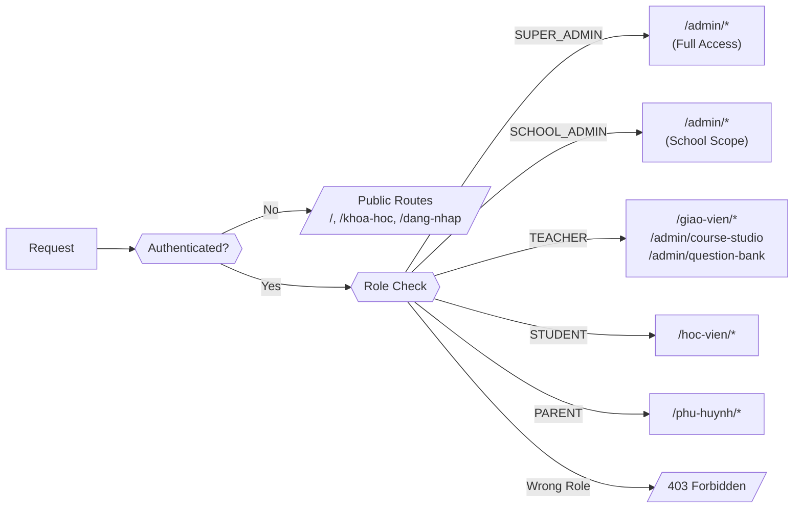

# AvaB V1.0 — Sitemap

> **Ngày tạo:** 2026-07-04  
> **Phiên bản:** 1.0  
> **Trạng thái:** Draft

---

## 1. Tổng quan Routes

| Nhóm | Prefix | Số routes hiện có | Số routes cần thêm |
|------|--------|:-----------------:|:------------------:|
| Public | `/` | 8 | 4 |
| Admin | `/admin` | 10 | 15 |
| Student | `/hoc-vien` | 1 | 8 |
| Teacher | `/giao-vien` | 1 | 6 |
| Parent | `/phu-huynh` | 1 | 5 |

---

## 2. Sitemap Đầy Đủ

### 2.1 Public Routes (Không cần đăng nhập)

```
/ (Landing Page)
├── /gioi-thieu              → Giới thiệu AvaB
├── /khoa-hoc                → Danh sách khóa học công khai ✅
│   └── /khoa-hoc/[slug]     → Chi tiết khóa học
├── /tin-tuc                 → Blog & Tin tức ✅
│   └── /tin-tuc/[slug]      → Chi tiết bài viết
├── /bang-vang               → Bảng vàng học viên ✅
├── /dang-ky                 → Đăng ký học ✅
├── /dang-nhap               → Đăng nhập ✅
├── /quen-mat-khau            → Quên mật khẩu 📋
├── /dat-lai-mat-khau         → Đặt lại mật khẩu 📋
├── /xac-thuc-email           → Xác thực email 📋
├── /lien-he                 → Liên hệ 📋
├── /tuyen-dung               → Tuyển dụng (hiện tại trong admin) 📋
└── /ai                      → Giới thiệu AI features ✅
```

### 2.2 Admin Routes (`/admin`)

```
/admin                           → Admin Dashboard ✅
│
├── /admin/users                 → Quản lý người dùng ✅
│   ├── /admin/users/new         → Tạo người dùng mới 📋
│   ├── /admin/users/[id]        → Chi tiết người dùng 📋
│   └── /admin/users/[id]/edit  → Chỉnh sửa người dùng 📋
│
├── /admin/schools               → Quản lý trường/trung tâm 📋
│   ├── /admin/schools/new       → Tạo trường mới 📋
│   └── /admin/schools/[id]      → Chi tiết trường 📋
│
├── /admin/programs              → Chương trình học 📋
│   ├── /admin/programs/new      → Tạo chương trình 📋
│   └── /admin/programs/[id]     → Chi tiết chương trình 📋
│
├── /admin/education-standards   → Chuẩn giáo dục ✅
│   └── /admin/education-standards/[id] → Chi tiết chuẩn 📋
│
├── /admin/subjects              → Quản lý môn học ✅
│   ├── /admin/subjects/new      → Tạo môn học 📋
│   └── /admin/subjects/[id]     → Chi tiết môn học 📋
│
├── /admin/courses               → Quản lý khóa học ✅
│   ├── /admin/courses/new       → Tạo khóa học 📋
│   └── /admin/courses/[id]      → Chi tiết khóa học 📋
│
├── /admin/course-studio         → Course Studio 🚧
│   ├── /admin/course-studio/projects          → Danh sách dự án 🚧
│   ├── /admin/course-studio/projects/new      → Tạo dự án mới 🚧
│   └── /admin/course-studio/projects/[id]     → Chi tiết dự án 🚧
│       ├── /admin/course-studio/projects/[id]/structure   → Cây nội dung 🚧
│       ├── /admin/course-studio/projects/[id]/editor      → Trình soạn thảo 🚧
│       └── /admin/course-studio/projects/[id]/preview     → Xem trước 🚧
│
├── /admin/content-studio        → Content Studio ✅
│   ├── /admin/content-studio/lessons          → Danh sách bài giảng 📋
│   ├── /admin/content-studio/lessons/new      → Tạo bài giảng mới 📋
│   └── /admin/content-studio/lessons/[id]     → Chỉnh sửa bài giảng 📋
│
├── /admin/question-bank         → Ngân hàng câu hỏi ✅
│   ├── /admin/question-bank/new              → Tạo câu hỏi 📋
│   ├── /admin/question-bank/[id]             → Chi tiết câu hỏi 📋
│   ├── /admin/question-bank/import           → Nhập câu hỏi từ file 📋
│   └── /admin/question-bank/generate         → Tạo câu hỏi bằng AI 📋
│
├── /admin/asset-library         → Thư viện tài nguyên 📋
│   ├── /admin/asset-library/images           → Hình ảnh 📋
│   ├── /admin/asset-library/videos           → Video 📋
│   ├── /admin/asset-library/audio            → Audio 📋
│   └── /admin/asset-library/documents        → Tài liệu 📋
│
├── /admin/ai-studio             → AI Studio ✅
│   ├── /admin/ai-studio/engines              → Danh sách AI Engines 🚧
│   ├── /admin/ai-studio/job-queue            → Hàng chờ công việc 🚧
│   ├── /admin/ai-studio/templates            → Prompt Templates 📋
│   └── /admin/ai-studio/analytics            → Phân tích AI 📋
│
├── /admin/ai-generator          → AI Generator (legacy) ✅
│
├── /admin/publishing            → Publishing Center 📋
│   ├── /admin/publishing/queue               → Hàng chờ duyệt 📋
│   ├── /admin/publishing/approved            → Đã duyệt 📋
│   └── /admin/publishing/published           → Đã xuất bản 📋
│
├── /admin/class-management      → Quản lý lớp học 📋
│   ├── /admin/class-management/classes       → Danh sách lớp 📋
│   ├── /admin/class-management/classes/new   → Tạo lớp mới 📋
│   └── /admin/class-management/classes/[id] → Chi tiết lớp 📋
│
├── /admin/enrollments           → Quản lý đăng ký ✅
│   ├── /admin/enrollments/new               → Đăng ký mới 📋
│   └── /admin/enrollments/[id]             → Chi tiết đăng ký 📋
│
├── /admin/analytics             → Analytics Center 📋
│   ├── /admin/analytics/overview            → Tổng quan 📋
│   ├── /admin/analytics/students            → Phân tích học viên 📋
│   ├── /admin/analytics/courses             → Phân tích khóa học 📋
│   ├── /admin/analytics/questions           → Phân tích câu hỏi 📋
│   └── /admin/analytics/finance             → Phân tích tài chính 📋
│
├── /admin/finance               → Quản lý tài chính ✅
│   ├── /admin/finance/tuition               → Thu học phí 📋
│   └── /admin/finance/reports               → Báo cáo tài chính 📋
│
├── /admin/news                  → Quản lý tin tức ✅
│   ├── /admin/news/new                      → Tạo bài viết 📋
│   └── /admin/news/[id]/edit               → Chỉnh sửa bài viết 📋
│
├── /admin/contacts              → Quản lý liên hệ ✅
│
├── /admin/notifications         → Notification Center 📋
│   ├── /admin/notifications/send            → Gửi thông báo 📋
│   └── /admin/notifications/history         → Lịch sử thông báo 📋
│
└── /admin/settings              → Cài đặt hệ thống 📋
    ├── /admin/settings/general              → Cài đặt chung 📋
    ├── /admin/settings/school               → Cài đặt trường 📋
    ├── /admin/settings/ai                   → Cài đặt AI 📋
    ├── /admin/settings/payment              → Cài đặt thanh toán 📋
    └── /admin/settings/integrations         → Tích hợp bên ngoài 📋
```

### 2.3 Student Routes (`/hoc-vien`)

```
/hoc-vien                        → Student Dashboard ✅
│
├── /hoc-vien/khoa-hoc           → Khóa học của tôi 📋
│   └── /hoc-vien/khoa-hoc/[id] → Chi tiết khóa học 📋
│       └── /hoc-vien/khoa-hoc/[id]/bai-hoc/[lessonId] → Học bài 📋
│
├── /hoc-vien/bai-tap            → Bài tập 📋
│   ├── /hoc-vien/bai-tap/[id]  → Làm bài tập 📋
│   └── /hoc-vien/bai-tap/[id]/ket-qua → Kết quả bài tập 📋
│
├── /hoc-vien/kiem-tra           → Bài kiểm tra 📋
│   ├── /hoc-vien/kiem-tra/[id] → Làm bài kiểm tra 📋
│   └── /hoc-vien/kiem-tra/[id]/ket-qua → Kết quả kiểm tra 📋
│
├── /hoc-vien/tien-do            → Tiến độ học tập 📋
│
├── /hoc-vien/thanh-tich         → Thành tích & Badges 📋
│
├── /hoc-vien/lich-hoc           → Lịch học 📋
│
├── /hoc-vien/ai-tutor           → AI Tutor 📋
│
└── /hoc-vien/ho-so              → Hồ sơ học viên 📋
```

### 2.4 Teacher Routes (`/giao-vien`)

```
/giao-vien                        → Teacher Dashboard 📋
│
├── /giao-vien/lop-hoc            → Lớp học của tôi 📋
│   └── /giao-vien/lop-hoc/[id]  → Chi tiết lớp 📋
│       ├── /giao-vien/lop-hoc/[id]/hoc-vien    → Danh sách học viên 📋
│       ├── /giao-vien/lop-hoc/[id]/diem-danh   → Điểm danh 📋
│       └── /giao-vien/lop-hoc/[id]/tien-do     → Tiến độ học viên 📋
│
├── /giao-vien/bai-giang          → Bài giảng của tôi 📋
│
├── /giao-vien/bai-tap            → Quản lý bài tập 📋
│   ├── /giao-vien/bai-tap/new   → Tạo bài tập 📋
│   └── /giao-vien/bai-tap/[id]/cham-diem → Chấm bài 📋
│
├── /giao-vien/bao-cao            → Báo cáo 📋
│
└── /giao-vien/ho-so              → Hồ sơ giáo viên ✅
```

### 2.5 Parent Routes (`/phu-huynh`)

```
/phu-huynh                        → Parent Dashboard ✅
│
├── /phu-huynh/con                → Thông tin con 📋
│   └── /phu-huynh/con/[id]/tien-do → Tiến độ học tập 📋
│
├── /phu-huynh/hoc-phi            → Học phí 📋
│   └── /phu-huynh/hoc-phi/thanh-toan → Thanh toán 📋
│
├── /phu-huynh/thong-bao          → Thông báo từ trường 📋
│
└── /phu-huynh/ho-so              → Hồ sơ phụ huynh 📋
```

### 2.6 API Routes (`/api`)

```
/api
├── /api/auth                    → NextAuth endpoints
│   ├── /api/auth/[...nextauth]  → Auth handlers
│   └── /api/auth/session        → Session info
│
├── /api/ai                      → AI endpoints
│   ├── /api/ai/generate-course  → Tạo course bằng AI
│   ├── /api/ai/generate-lesson  → Tạo lesson bằng AI
│   ├── /api/ai/generate-questions → Tạo câu hỏi
│   ├── /api/ai/job-status/[id]  → Trạng thái job
│   └── /api/ai/tutor            → AI Tutor chat
│
├── /api/courses                 → Course CRUD
├── /api/lessons                 → Lesson CRUD
├── /api/questions               → Question CRUD
├── /api/enrollments             → Enrollment management
├── /api/users                   → User management
├── /api/finance                 → Finance operations
├── /api/notifications           → Push notifications
└── /api/analytics               → Analytics data
```

---

## 3. Mermaid Sitemap Diagram

```mermaid
flowchart TD
    ROOT["/\nLanding Page"]
    
    ROOT --> PUBLIC["🌐 Public Routes"]
    ROOT --> ADMIN["⚙️ /admin"]
    ROOT --> STUDENT["👨‍🎓 /hoc-vien"]
    ROOT --> TEACHER["👩‍🏫 /giao-vien"]
    ROOT --> PARENT["👨‍👩‍👧 /phu-huynh"]

    PUBLIC --> PUB1["/khoa-hoc\nCourse Catalog"]
    PUBLIC --> PUB2["/tin-tuc\nNews"]
    PUBLIC --> PUB3["/dang-ky\nRegister"]
    PUBLIC --> PUB4["/dang-nhap\nLogin"]
    PUBLIC --> PUB5["/bang-vang\nLeaderboard"]

    ADMIN --> ADM1["/admin\nDashboard"]
    ADMIN --> ADM2["/admin/course-studio\nCourse Studio"]
    ADMIN --> ADM3["/admin/ai-studio\nAI Studio"]
    ADMIN --> ADM4["/admin/question-bank\nQuestion Bank"]
    ADMIN --> ADM5["/admin/users\nUser Mgmt"]
    ADMIN --> ADM6["/admin/enrollments\nEnrollments"]
    ADMIN --> ADM7["/admin/finance\nFinance"]
    ADMIN --> ADM8["/admin/analytics\nAnalytics"]
    ADMIN --> ADM9["/admin/publishing\nPublishing"]
    ADMIN --> ADM10["/admin/settings\nSettings"]

    STUDENT --> STU1["Dashboard"]
    STUDENT --> STU2["My Courses"]
    STUDENT --> STU3["Assignments"]
    STUDENT --> STU4["AI Tutor"]
    STUDENT --> STU5["Progress"]
    STUDENT --> STU6["Achievements"]

    TEACHER --> TEA1["Dashboard"]
    TEACHER --> TEA2["My Classes"]
    TEACHER --> TEA3["Teaching Materials"]
    TEACHER --> TEA4["Grading"]
    TEACHER --> TEA5["Reports"]

    PARENT --> PAR1["Dashboard"]
    PARENT --> PAR2["My Children"]
    PARENT --> PAR3["Tuition"]
    PARENT --> PAR4["Messages"]

    style ROOT fill:#4F46E5,color:#fff
    style PUBLIC fill:#0EA5E9,color:#fff
    style ADMIN fill:#DC2626,color:#fff
    style STUDENT fill:#16A34A,color:#fff
    style TEACHER fill:#D97706,color:#fff
    style PARENT fill:#9333EA,color:#fff
```



---

## 4. Route Status Legend

| Symbol | Nghĩa |
|--------|-------|
| ✅ | Đã có trong codebase hiện tại |
| 🚧 | Đang phát triển / WIP |
| 📋 | Cần xây dựng theo spec V1.0 |

---

## 5. Route Naming Convention

| Pattern | Mô tả | Ví dụ |
|---------|-------|-------|
| `/[noun]` | Danh sách | `/admin/users` |
| `/[noun]/new` | Tạo mới | `/admin/users/new` |
| `/[noun]/[id]` | Chi tiết | `/admin/users/123` |
| `/[noun]/[id]/edit` | Chỉnh sửa | `/admin/users/123/edit` |
| `/[noun]/[id]/[action]` | Hành động | `/admin/courses/123/publish` |
| Tiếng Việt (Public) | Routes public dùng slug tiếng Việt | `/hoc-vien`, `/giao-vien` |
| Tiếng Anh (Admin) | Routes admin dùng tiếng Anh | `/admin/course-studio` |

---

## 6. Route Guards & Access Control



---

*Sitemap này cần được cập nhật mỗi khi thêm route mới. Đánh dấu status ✅/🚧/📋 theo trạng thái thực tế.*
