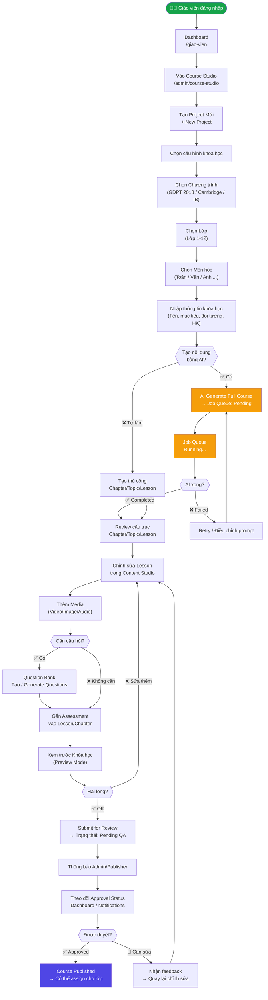
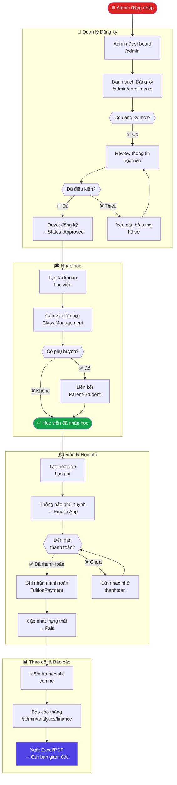
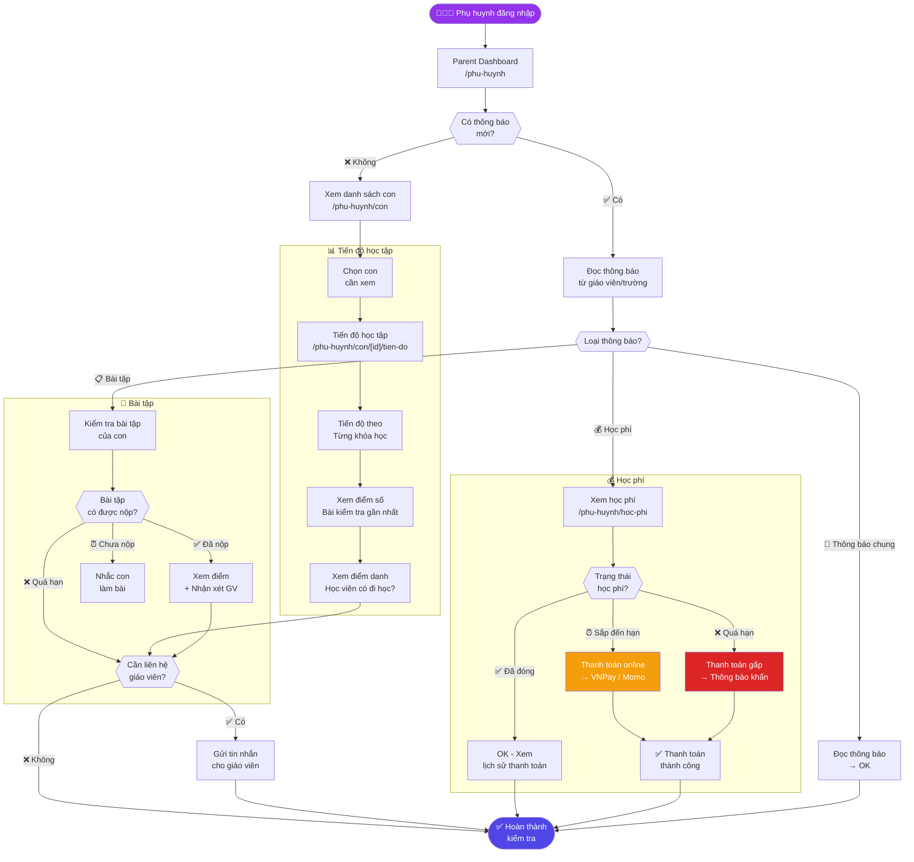
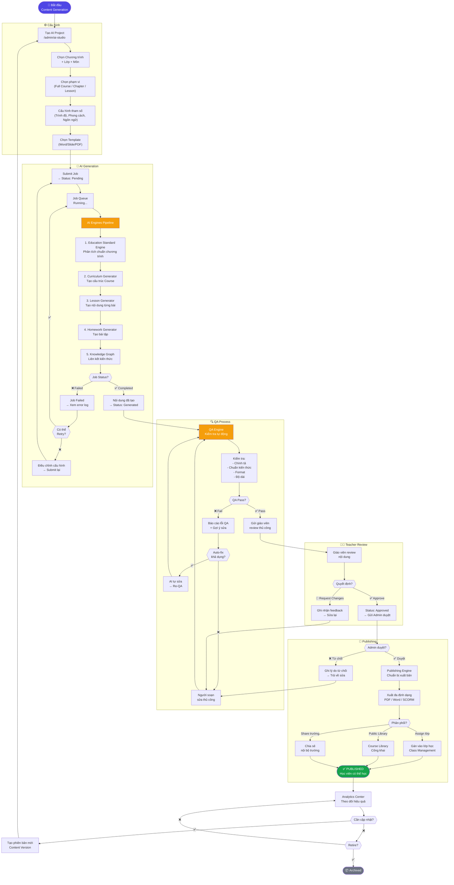

```mermaid
flowchart TD
    START(["👨‍🎓 Học viên đăng nhập"]) --> DASH["Student Dashboard\n/hoc-vien"]
    
    DASH --> CHECK_TODO{{"Có bài tập\nquá hạn?"}}
    CHECK_TODO -->|"⚠️ Có"| ALERT["Cảnh báo: Bài tập\ncần nộp gấp"]
    ALERT --> DO_HW
    CHECK_TODO -->|"✅ Không"| CONTINUE["Tiếp tục học\nkhóa học đang dở"]
    
    CONTINUE --> COURSE["Trang Khóa học\n/hoc-vien/khoa-hoc/[id]"]
    COURSE --> LESSON["Mở Bài học\n/hoc-vien/khoa-hoc/[id]/bai-hoc/[lessonId]"]
    
    subgraph LEARNING["📖 Quá trình học"]
        LESSON --> READ["Đọc nội dung\nLý thuyết + Ví dụ"]
        READ --> WATCH{{"Có video?"}}
        WATCH -->|"✅ Có"| VIDEO["Xem video\nbài giảng"]
        WATCH -->|"❌ Không"| INTERACT
        VIDEO --> INTERACT["Tương tác\nDrag & Drop / Interactive"]
        INTERACT --> MINI_QUIZ{{"Có câu hỏi\nthực hành?"}}
        MINI_QUIZ -->|"✅ Có"| PRACTICE["Làm câu hỏi\nthực hành"]
        PRACTICE --> CHECK_ANS{{"Đúng?"}}
        CHECK_ANS -->|"✅"| NEXT_ACT["Tiếp tục\nhoạt động"]
        CHECK_ANS -->|"❌"| HINT["Xem gợi ý\n→ Thử lại"]
        HINT --> PRACTICE
        MINI_QUIZ -->|"❌ Không"| NEXT_ACT
        NEXT_ACT --> LESSON_DONE{{"Hết bài?"}}
        LESSON_DONE -->|"❌"| READ
    end
    
    LESSON_DONE -->|"✅"| LESSON_COMPLETE["Bài học hoàn thành\n+XP Points"]
    LESSON_COMPLETE --> DO_HW{{"Có bài tập\nkhóa học?"}}
    DO_HW -->|"✅ Có"| HW["Làm bài tập\n/hoc-vien/bai-tap/[id]"]
    DO_HW -->|"❌ Không"| NEXT_LESSON
    
    HW --> SUBMIT_HW["Nộp bài tập"]
    SUBMIT_HW --> RESULT["Xem kết quả\n+ Giải thích"]
    RESULT --> CONFUSED{{"Không hiểu\nbài?"}}
    CONFUSED -->|"✅ Có"| AI_TUTOR["Hỏi AI Tutor\n/hoc-vien/ai-tutor"]
    AI_TUTOR --> EXPLAINED["AI giải thích\n→ Hiểu hơn"]
    CONFUSED -->|"❌ Không"| NEXT_LESSON
    EXPLAINED --> NEXT_LESSON
    
    NEXT_LESSON --> PROGRESS["Xem tiến độ\n/hoc-vien/tien-do"]
    PROGRESS --> BADGE{{"Đạt badge\nmới?"}}
    BADGE -->|"✅ Có"| CELEBRATE["🎉 Nhận Badge!\nThành tích mới"]
    BADGE -->|"❌ Không"| DONE
    CELEBRATE --> DONE(["✅ Phiên học hoàn thành"])
    
    style START fill:#16A34A,color:#fff
    style DONE fill:#4F46E5,color:#fff
    style AI_TUTOR fill:#F59E0B,color:#fff
    style CELEBRATE fill:#EC4899,color:#fff
```

# AvaB V1.0 — User Flows

> **Ngày tạo:** 2026-07-04  
> **Phiên bản:** 1.0  
> **Trạng thái:** Draft

---

## Tổng quan

Tài liệu này mô tả 5 user flow chính trong AvaB V1.0, bao gồm:
1. **Teacher Flow:** Tạo Course từ đầu với AI
2. **Admin Flow:** Quản lý học viên và học phí
3. **Student Flow:** Học và làm bài tập
4. **Parent Flow:** Xem tiến độ con
5. **AI Content Generation Flow:** Course → AI → Review → Publish

---

## Flow 1: Teacher — Tạo Course với AI

### Mô tả
Giáo viên sử dụng AI để tạo toàn bộ khóa học từ đầu, chỉnh sửa, và gửi duyệt.

### Happy Path Steps
1. Giáo viên đăng nhập và vào Course Studio
2. Tạo Project mới
3. Chọn Chương trình → Lớp → Môn học
4. Cấu hình thông tin khóa học (tên, mục tiêu, đối tượng)
5. Nhấn "Generate Full Course" → AI tạo cấu trúc
6. Review cấu trúc Chapter/Topic/Lesson
7. Chỉnh sửa từng Lesson trong Content Studio
8. Tạo/chỉnh sửa câu hỏi trong Question Bank
9. Gắn Assessment vào các Lesson
10. Gửi duyệt (Submit for Review)
11. Theo dõi trạng thái Approval

### Mermaid Flowchart



---

## Flow 2: Admin — Quản lý Học viên và Học phí

### Mô tả
Admin trường quản lý toàn bộ vòng đời từ đăng ký → nhập học → thu học phí → theo dõi.

### Happy Path Steps
1. Admin nhận thông tin đăng ký từ học viên mới
2. Kiểm tra và duyệt đăng ký
3. Tạo Enrollment (nhập học)
4. Gán vào lớp học phù hợp
5. Tạo invoice học phí
6. Thu học phí (ghi nhận thanh toán)
7. Theo dõi học phí còn nợ
8. Tạo báo cáo tài chính

### Mermaid Flowchart



---

## Flow 3: Student — Học và Làm bài tập

### Mô tả
Học viên đăng nhập, tiếp tục học bài, làm bài tập và kiểm tra tiến độ.

### Happy Path Steps
1. Học viên đăng nhập
2. Xem Dashboard (tiến độ, bài tập cần làm)
3. Chọn khóa học để tiếp tục
4. Học bài (đọc, xem video, tương tác)
5. Làm bài tập cuối bài
6. Nhận kết quả và XP
7. Xem tiến độ tổng thể
8. Hỏi AI Tutor khi không hiểu

### Mermaid Flowchart



---

## Flow 4: Parent — Xem Tiến độ Con

### Mô tả
Phụ huynh đăng nhập để theo dõi tiến độ học tập, học phí và liên lạc với giáo viên.

### Happy Path Steps
1. Phụ huynh đăng nhập
2. Xem dashboard tổng hợp về con
3. Kiểm tra tiến độ học từng môn
4. Xem bài tập chưa làm
5. Kiểm tra học phí
6. Xem thông báo từ giáo viên/trường

### Mermaid Flowchart



---

## Flow 5: AI Content Generation — Course → AI → Review → Publish

### Mô tả
Quy trình đầy đủ từ khi khởi tạo course đến khi xuất bản, bao gồm Job Queue và Approval Workflow.

### Approval States
```
Draft → Generate → QA → Teacher Review → Approved → Published → Archived
```

### Mermaid Flowchart



---

## Phụ lục: Flow Tóm tắt

| Flow | Actor | Start | End | Thời gian ước tính |
|------|-------|-------|-----|---------------------|
| Teacher tạo Course | Teacher | Login | Course Published | 2-4 giờ |
| Admin quản lý HV | Admin | Nhận đăng ký | Báo cáo tài chính | Liên tục |
| Student học bài | Student | Login | Hoàn thành phiên | 30-60 phút |
| Parent theo dõi | Parent | Login | Kiểm tra xong | 5-10 phút |
| AI Generation | Teacher/Admin | Configure | Published | 30-120 phút |

---

## Edge Cases & Error States

### Flow 1 (Teacher)
- AI generation timeout → Hiển thị retry button + email notification
- AI content quality thấp → QA Engine flag + suggest manual edit
- Permission denied → Redirect to login

### Flow 2 (Admin)
- Duplicate student → Warning + merge option
- Payment failure → Retry với cách khác
- Class full → Waitlist option

### Flow 3 (Student)
- Network offline → Cache bài học cho offline
- Video không load → Text fallback
- Hết session → Auto-save progress

### Flow 4 (Parent)
- Không có con nào → Onboarding để link con
- Thanh toán fail → Alternative payment methods

### Flow 5 (AI Generation)
- Token limit exceeded → Chia nhỏ generation job
- API rate limit → Queue với backoff
- Nội dung không phù hợp → Flag + human review

---

*Flows này cần được validate với prototype/usability testing trước khi development.*
