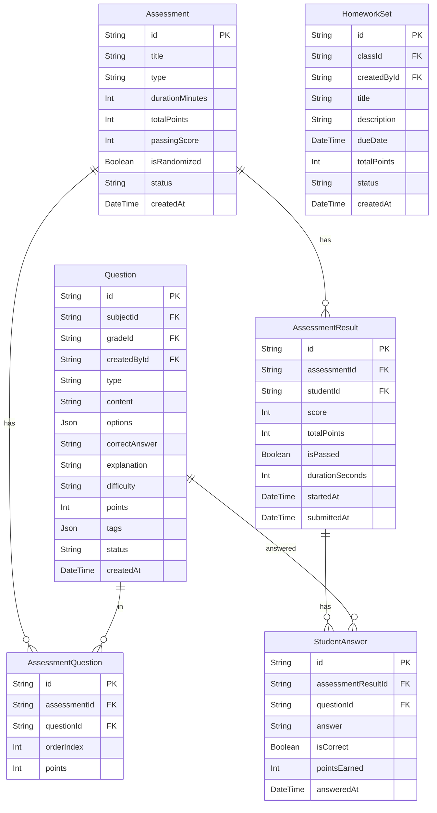
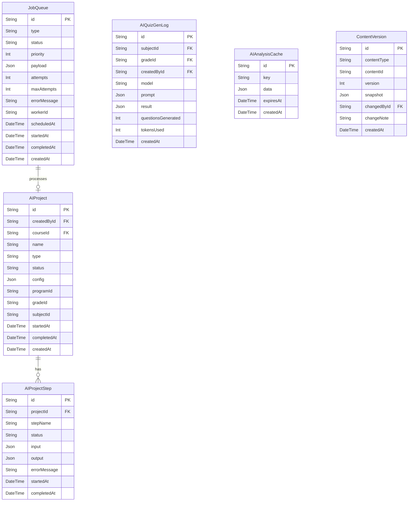
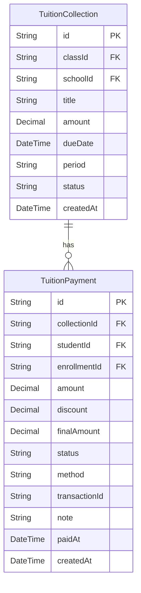
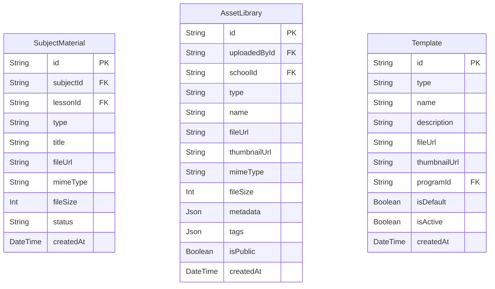
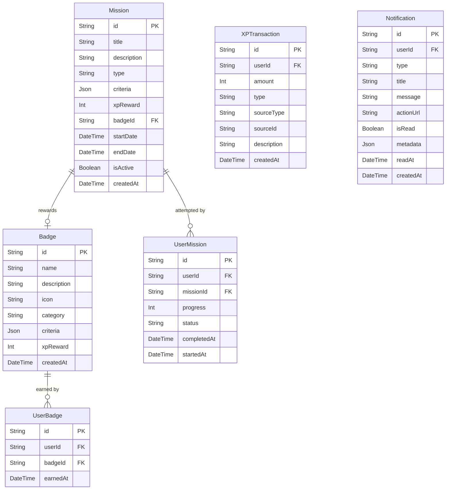

# AvaB V1.0 — Database ERD

> **Ngày tạo:** 2026-07-04  
> **Phiên bản:** 1.0  
> **Trạng thái:** Draft

---

## 1. Tổng quan Schema

### 1.1 Models hiện có (✅ Existing)

| Model | Mô tả |
|-------|-------|
| User | Người dùng (tất cả roles) |
| LearnerProfile | Hồ sơ học viên chi tiết |
| Course | Khóa học |
| Curriculum | Chương trình học (basic) |
| Enrollment | Đăng ký khóa học |
| Subject | Môn học |
| HomeworkSet | Bộ bài tập |
| SubjectMaterial | Tài liệu môn học |
| Question | Câu hỏi |
| StudentAnswer | Câu trả lời của học viên |
| News | Tin tức |
| Recruitment | Tuyển dụng |
| TuitionCollection | Thu học phí |
| TuitionPayment | Thanh toán học phí |
| SessionFeedback | Phản hồi buổi học |
| StudentSessionRecord | Lịch sử buổi học |
| AIQuizGenLog | Log tạo quiz AI |
| AIAnalysisCache | Cache phân tích AI |
| ParentStudentLink | Liên kết Phụ huynh-Học viên |
| AIProject | Dự án AI |
| AIProjectStep | Bước trong AI Project |
| Registration | Đăng ký (lead/contact) |

### 1.2 Models cần thêm (📋 New in V1.0)

| Model | Mô tả |
|-------|-------|
| School | Trường / Trung tâm |
| Program | Chương trình học tổng thể |
| Grade | Lớp học |
| Chapter | Chương trong Course |
| Topic | Chủ đề trong Chapter |
| Lesson | Bài học trong Topic |
| Activity | Hoạt động trong Lesson |
| Assessment | Bài kiểm tra |
| AssessmentResult | Kết quả kiểm tra |
| JobQueue | Hàng chờ background jobs |
| ContentVersion | Lịch sử phiên bản nội dung |
| Template | Mẫu nội dung |
| AssetLibrary | Thư viện tài nguyên |
| Notification | Thông báo |
| Badge | Huy hiệu |
| Mission | Nhiệm vụ gamification |
| XPTransaction | Lịch sử điểm XP |
| Class | Lớp học (nhóm học viên) |
| ClassSchedule | Lịch học |
| Attendance | Điểm danh |

---

## 2. Mermaid ERD — Core Content Hierarchy

```mermaid
erDiagram
    Program {
        String id PK
        String name
        String code
        String type
        String description
        String country
        Boolean isActive
        DateTime createdAt
        DateTime updatedAt
    }

    Grade {
        String id PK
        String programId FK
        String name
        Int orderIndex
        String description
        Boolean isActive
        DateTime createdAt
    }

    Subject {
        String id PK
        String gradeId FK
        String name
        String code
        String description
        String icon
        String color
        Boolean isActive
        DateTime createdAt
    }

    Course {
        String id PK
        String subjectId FK
        String schoolId FK
        String createdById FK
        String title
        String description
        String objectives
        String status
        String term
        Int year
        DateTime publishedAt
        DateTime createdAt
        DateTime updatedAt
    }

    Chapter {
        String id PK
        String courseId FK
        String title
        String description
        Int orderIndex
        String status
        DateTime createdAt
    }

    Topic {
        String id PK
        String chapterId FK
        String title
        String description
        Int orderIndex
        String status
        DateTime createdAt
    }

    Lesson {
        String id PK
        String topicId FK
        String title
        String content
        Int durationMinutes
        Int orderIndex
        String status
        String contentType
        DateTime createdAt
        DateTime updatedAt
    }

    Activity {
        String id PK
        String lessonId FK
        String type
        String title
        Json content
        Int orderIndex
        Boolean isRequired
        Int xpReward
        DateTime createdAt
    }

    Assessment {
        String id PK
        String lessonId FK
        String chapterId FK
        String courseId FK
        String title
        String type
        Int durationMinutes
        Int totalPoints
        Int passingScore
        Boolean isRandomized
        String status
        DateTime createdAt
    }

    Program ||--o{ Grade : "has"
    Grade ||--o{ Subject : "has"
    Subject ||--o{ Course : "has"
    Course ||--o{ Chapter : "has"
    Chapter ||--o{ Topic : "has"
    Topic ||--o{ Lesson : "has"
    Lesson ||--o{ Activity : "has"
    Lesson ||--o{ Assessment : "has"
    Chapter ||--o{ Assessment : "has"
    Course ||--o{ Assessment : "has"
```



---

## 3. Mermaid ERD — User & Organization

```mermaid
erDiagram
    School {
        String id PK
        String name
        String code
        String type
        String address
        String phone
        String email
        String logo
        Json settings
        Boolean isActive
        DateTime createdAt
    }

    User {
        String id PK
        String schoolId FK
        String email
        String name
        String password
        String role
        String avatar
        String phone
        Boolean isActive
        DateTime lastLoginAt
        DateTime createdAt
    }

    LearnerProfile {
        String id PK
        String userId FK
        String gradeId FK
        String studentCode
        String guardianName
        String guardianPhone
        DateTime dateOfBirth
        Json learningStyle
        Int totalXP
        DateTime createdAt
    }

    ParentStudentLink {
        String id PK
        String parentId FK
        String studentId FK
        String relationship
        Boolean isPrimary
        DateTime createdAt
    }

    Class {
        String id PK
        String schoolId FK
        String courseId FK
        String teacherId FK
        String name
        String academicYear
        String term
        Int maxStudents
        Boolean isActive
        DateTime createdAt
    }

    Enrollment {
        String id PK
        String classId FK
        String studentId FK
        String status
        DateTime enrolledAt
        DateTime completedAt
        Int finalScore
    }

    School ||--o{ User : "has"
    User ||--o| LearnerProfile : "has"
    User ||--o{ ParentStudentLink : "parent"
    User ||--o{ ParentStudentLink : "student"
    School ||--o{ Class : "has"
    User ||--o{ Class : "teaches"
    Class ||--o{ Enrollment : "has"
    User ||--o{ Enrollment : "enrolls"
```

---

## 4. Mermaid ERD — Questions & Assessments



---

## 5. Mermaid ERD — AI & Job System



---

## 6. Mermaid ERD — Finance



---

## 7. Mermaid ERD — Content & Assets



---

## 8. Mermaid ERD — Gamification & Notifications



---

## 9. Mermaid ERD — Scheduling & Attendance

```mermaid
erDiagram
    ClassSchedule {
        String id PK
        String classId FK
        String dayOfWeek
        String startTime
        String endTime
        String roomLocation
        DateTime effectiveFrom
        DateTime effectiveTo
        Boolean isActive
        DateTime createdAt
    }

    Attendance {
        String id PK
        String classId FK
        String studentId FK
        String teacherId FK
        DateTime sessionDate
        String status
        String note
        DateTime checkedInAt
        DateTime createdAt
    }

    SessionFeedback {
        String id PK
        String sessionId FK
        String studentId FK
        Int rating
        String comment
        Json data
        DateTime createdAt
    }

    StudentSessionRecord {
        String id PK
        String classId FK
        String studentId FK
        DateTime sessionDate
        String topic
        String note
        Json performance
        DateTime createdAt
    }

    Class ||--o{ ClassSchedule : "has"
    Class ||--o{ Attendance : "tracks"
    User ||--o{ Attendance : "records"
    StudentSessionRecord ||--o{ SessionFeedback : "has"
```

---

## 10. Tổng hợp Schema V1.0

### Models sẽ có sau V1.0

```
Core Content (7):    Program, Grade, Subject, Course, Chapter, Topic, Lesson
Interactions (3):    Activity, Assessment, AssessmentQuestion
Results (3):         AssessmentResult, StudentAnswer, ContentVersion
Organization (5):    School, User, LearnerProfile, Class, Enrollment
Links (2):           ParentStudentLink, ClassSchedule
AI System (5):       AIProject, AIProjectStep, JobQueue, AIQuizGenLog, AIAnalysisCache
Finance (2):         TuitionCollection, TuitionPayment
Content (3):         SubjectMaterial, AssetLibrary, Template
Gamification (5):    Badge, Mission, XPTransaction, UserBadge, UserMission
Communication (3):   Notification, SessionFeedback, StudentSessionRecord
Admin (3):           News, Recruitment, Registration, HomeworkSet

Total: ~37 models
```

---

## 11. Index Strategy

### Critical Indexes

```sql
-- Course queries
CREATE INDEX idx_course_subject ON Course(subjectId);
CREATE INDEX idx_course_school ON Course(schoolId);
CREATE INDEX idx_course_status ON Course(status);

-- Enrollment queries
CREATE INDEX idx_enrollment_class ON Enrollment(classId);
CREATE INDEX idx_enrollment_student ON Enrollment(studentId);
CREATE INDEX idx_enrollment_status ON Enrollment(status);

-- Question Bank
CREATE INDEX idx_question_subject ON Question(subjectId, gradeId);
CREATE INDEX idx_question_status ON Question(status);
CREATE INDEX idx_question_difficulty ON Question(difficulty);

-- Assessment Results
CREATE INDEX idx_result_student ON AssessmentResult(studentId);
CREATE INDEX idx_result_assessment ON AssessmentResult(assessmentId);

-- Job Queue
CREATE INDEX idx_job_status ON JobQueue(status, scheduledAt);
CREATE INDEX idx_job_type ON JobQueue(type, status);

-- Notifications
CREATE INDEX idx_notif_user ON Notification(userId, isRead);
```

---

*Schema này là spec mục tiêu cho V1.0. Migration cần được thực hiện theo thứ tự: Organization → Content Hierarchy → Assessment → AI System → Gamification → Communication.*
