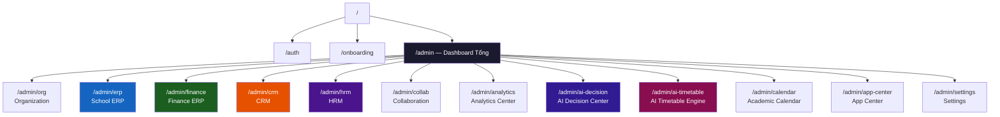
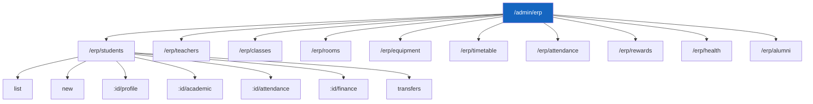
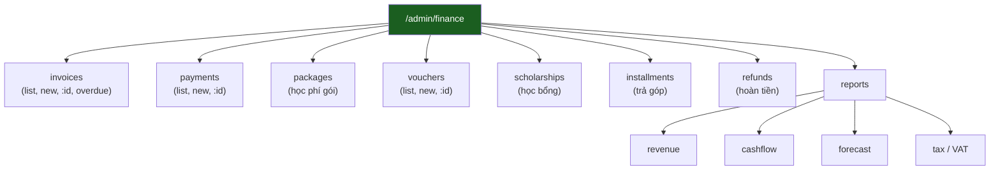
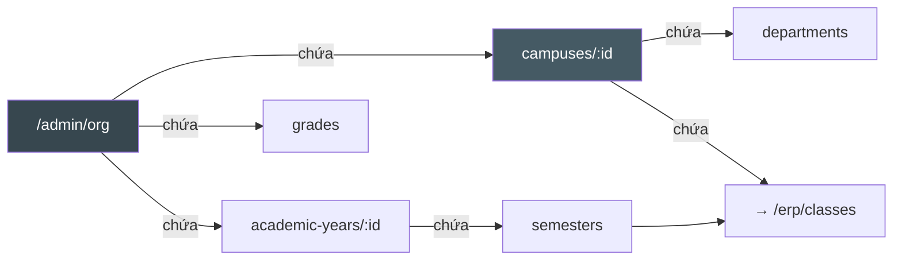

# AvaB EOS v2.0 — System Sitemap (Sơ đồ Hệ thống)

> **Date:** 2026-07-04  
> **Version:** 2.0  
> **Status:** Architecture Planning

---

## 1. Tổng Quan Cấu Trúc URL

Hệ thống AvaB EOS v2.0 sử dụng cấu trúc URL theo module với prefix `/admin` cho web portal, `/api/v2` cho REST API, và sub-domain cho từng campus (optional).

### URL Patterns

```
# Single campus
https://app.avab.vn/admin/...

# Multi-campus (subdomain)
https://{slug}.avab.vn/admin/...

# API
https://api.avab.vn/v2/...

# Mobile deep links
avab://module/resource/id
```

---

## 2. Full Sitemap — Dạng Cây

```
/ (Root)
├── /auth
│   ├── /auth/login
│   ├── /auth/forgot-password
│   ├── /auth/reset-password
│   └── /auth/sso                          ← Google, Microsoft SSO
│
├── /onboarding                            ← Setup wizard (new org)
│   ├── /onboarding/organization
│   ├── /onboarding/campus
│   ├── /onboarding/import-data
│   └── /onboarding/complete
│
└── /admin                                 ← Main Admin Shell
    │
    ├── /admin (Dashboard Tổng)
    │   └── [Org Overview / Campus Overview tùy role]
    │
    ├── /admin/org                         ← Organization Management
    │   ├── /admin/org/overview            ← Tổng quan tổ chức
    │   ├── /admin/org/campuses            ← Danh sách cơ sở
    │   │   ├── /admin/org/campuses/new    ← Thêm cơ sở mới
    │   │   └── /admin/org/campuses/:id   ← Chi tiết cơ sở
    │   │       ├── /admin/org/campuses/:id/settings
    │   │       ├── /admin/org/campuses/:id/staff
    │   │       └── /admin/org/campuses/:id/analytics
    │   ├── /admin/org/departments         ← Bộ môn
    │   │   ├── /admin/org/departments/new
    │   │   └── /admin/org/departments/:id
    │   ├── /admin/org/academic-years      ← Năm học
    │   │   ├── /admin/org/academic-years/new
    │   │   └── /admin/org/academic-years/:id
    │   │       └── /admin/org/academic-years/:id/semesters
    │   ├── /admin/org/grades              ← Khối lớp (1-12)
    │   └── /admin/org/settings            ← Cài đặt tổ chức
    │       ├── /admin/org/settings/general
    │       ├── /admin/org/settings/branding
    │       ├── /admin/org/settings/billing
    │       └── /admin/org/settings/integrations
    │
    ├── /admin/erp                         ← School ERP Hub
    │   ├── /admin/erp (Overview)
    │   │
    │   ├── /admin/erp/students            ← Quản lý học sinh
    │   │   ├── /admin/erp/students/list
    │   │   ├── /admin/erp/students/new    ← Nhập học mới
    │   │   ├── /admin/erp/students/import ← Nhập bulk CSV
    │   │   ├── /admin/erp/students/:id
    │   │   │   ├── /admin/erp/students/:id/profile
    │   │   │   ├── /admin/erp/students/:id/academic
    │   │   │   ├── /admin/erp/students/:id/attendance
    │   │   │   ├── /admin/erp/students/:id/finance
    │   │   │   ├── /admin/erp/students/:id/health
    │   │   │   ├── /admin/erp/students/:id/rewards
    │   │   │   └── /admin/erp/students/:id/documents
    │   │   └── /admin/erp/students/transfers ← Chuyển cơ sở
    │   │
    │   ├── /admin/erp/teachers            ← Quản lý giáo viên
    │   │   ├── /admin/erp/teachers/list
    │   │   ├── /admin/erp/teachers/new
    │   │   ├── /admin/erp/teachers/:id
    │   │   │   ├── /admin/erp/teachers/:id/profile
    │   │   │   ├── /admin/erp/teachers/:id/schedule
    │   │   │   ├── /admin/erp/teachers/:id/classes
    │   │   │   ├── /admin/erp/teachers/:id/performance
    │   │   │   └── /admin/erp/teachers/:id/documents
    │   │   └── /admin/erp/teachers/assignments ← Phân công GV
    │   │
    │   ├── /admin/erp/classes             ← Quản lý lớp học
    │   │   ├── /admin/erp/classes/list
    │   │   ├── /admin/erp/classes/new
    │   │   └── /admin/erp/classes/:id
    │   │       ├── /admin/erp/classes/:id/students
    │   │       ├── /admin/erp/classes/:id/schedule
    │   │       ├── /admin/erp/classes/:id/attendance
    │   │       └── /admin/erp/classes/:id/results
    │   │
    │   ├── /admin/erp/rooms               ← Phòng học
    │   │   ├── /admin/erp/rooms/list
    │   │   ├── /admin/erp/rooms/new
    │   │   ├── /admin/erp/rooms/:id
    │   │   └── /admin/erp/rooms/availability ← Lịch phòng
    │   │
    │   ├── /admin/erp/equipment           ← Thiết bị
    │   │   ├── /admin/erp/equipment/list
    │   │   ├── /admin/erp/equipment/new
    │   │   ├── /admin/erp/equipment/:id
    │   │   └── /admin/erp/equipment/maintenance ← Lịch bảo trì
    │   │
    │   ├── /admin/erp/timetable           ← Thời khóa biểu
    │   │   ├── /admin/erp/timetable/view  ← Xem TKB (grid)
    │   │   ├── /admin/erp/timetable/edit  ← Chỉnh sửa thủ công
    │   │   └── /admin/erp/timetable/publish ← Xuất bản TKB
    │   │
    │   ├── /admin/erp/attendance          ← Điểm danh
    │   │   ├── /admin/erp/attendance/today ← Điểm danh hôm nay
    │   │   ├── /admin/erp/attendance/history
    │   │   └── /admin/erp/attendance/reports
    │   │
    │   ├── /admin/erp/rewards             ← Khen thưởng & Kỷ luật
    │   │   ├── /admin/erp/rewards/list
    │   │   ├── /admin/erp/rewards/new
    │   │   └── /admin/erp/rewards/reports
    │   │
    │   ├── /admin/erp/health              ← Hồ sơ sức khỏe
    │   │   ├── /admin/erp/health/records
    │   │   ├── /admin/erp/health/incidents
    │   │   └── /admin/erp/health/reports
    │   │
    │   └── /admin/erp/alumni             ← Cựu học sinh
    │       ├── /admin/erp/alumni/list
    │       └── /admin/erp/alumni/events
    │
    ├── /admin/finance                     ← Finance ERP Hub
    │   ├── /admin/finance (Dashboard)
    │   │
    │   ├── /admin/finance/invoices        ← Hóa đơn
    │   │   ├── /admin/finance/invoices/list
    │   │   ├── /admin/finance/invoices/new
    │   │   ├── /admin/finance/invoices/:id
    │   │   └── /admin/finance/invoices/overdue ← Quá hạn
    │   │
    │   ├── /admin/finance/payments        ← Thanh toán
    │   │   ├── /admin/finance/payments/list
    │   │   ├── /admin/finance/payments/new ← Ghi nhận thủ công
    │   │   └── /admin/finance/payments/:id
    │   │
    │   ├── /admin/finance/packages        ← Gói học phí
    │   │   ├── /admin/finance/packages/list
    │   │   ├── /admin/finance/packages/new
    │   │   └── /admin/finance/packages/:id
    │   │
    │   ├── /admin/finance/vouchers        ← Voucher & Khuyến mãi
    │   │   ├── /admin/finance/vouchers/list
    │   │   ├── /admin/finance/vouchers/new
    │   │   └── /admin/finance/vouchers/:id
    │   │
    │   ├── /admin/finance/scholarships    ← Học bổng
    │   │   ├── /admin/finance/scholarships/list
    │   │   ├── /admin/finance/scholarships/new
    │   │   └── /admin/finance/scholarships/:id
    │   │
    │   ├── /admin/finance/installments    ← Trả góp
    │   │   └── /admin/finance/installments/list
    │   │
    │   ├── /admin/finance/refunds         ← Hoàn tiền
    │   │   ├── /admin/finance/refunds/list
    │   │   └── /admin/finance/refunds/new
    │   │
    │   └── /admin/finance/reports         ← Báo cáo tài chính
    │       ├── /admin/finance/reports/revenue ← Doanh thu
    │       ├── /admin/finance/reports/cashflow ← Cash flow
    │       ├── /admin/finance/reports/forecast ← Dự báo
    │       └── /admin/finance/reports/tax  ← Hóa đơn VAT
    │
    ├── /admin/crm                         ← CRM Hub
    │   ├── /admin/crm (Dashboard)
    │   │
    │   ├── /admin/crm/leads               ← Danh sách leads
    │   │   ├── /admin/crm/leads/list
    │   │   ├── /admin/crm/leads/new
    │   │   └── /admin/crm/leads/:id
    │   │
    │   ├── /admin/crm/pipeline            ← Kanban pipeline
    │   │   └── /admin/crm/pipeline/board  ← Drag-drop stages
    │   │
    │   ├── /admin/crm/campaigns           ← Marketing campaigns
    │   │   ├── /admin/crm/campaigns/list
    │   │   ├── /admin/crm/campaigns/new
    │   │   └── /admin/crm/campaigns/:id
    │   │
    │   ├── /admin/crm/activities          ← Lịch sử tư vấn
    │   └── /admin/crm/reports             ← Báo cáo CRM
    │       ├── /admin/crm/reports/conversion
    │       ├── /admin/crm/reports/source
    │       └── /admin/crm/reports/advisor
    │
    ├── /admin/hrm                         ← HRM Hub
    │   ├── /admin/hrm (Dashboard)
    │   │
    │   ├── /admin/hrm/staff               ← Nhân sự
    │   │   ├── /admin/hrm/staff/list
    │   │   ├── /admin/hrm/staff/new
    │   │   └── /admin/hrm/staff/:id
    │   │       ├── /admin/hrm/staff/:id/profile
    │   │       ├── /admin/hrm/staff/:id/contract
    │   │       ├── /admin/hrm/staff/:id/timesheet
    │   │       ├── /admin/hrm/staff/:id/leaves
    │   │       ├── /admin/hrm/staff/:id/kpi
    │   │       └── /admin/hrm/staff/:id/payroll
    │   │
    │   ├── /admin/hrm/recruitment         ← Tuyển dụng
    │   │   ├── /admin/hrm/recruitment/jobs ← Tin tuyển dụng
    │   │   └── /admin/hrm/recruitment/applications
    │   │
    │   ├── /admin/hrm/timesheet           ← Chấm công
    │   │   ├── /admin/hrm/timesheet/today
    │   │   └── /admin/hrm/timesheet/reports
    │   │
    │   ├── /admin/hrm/leaves              ← Nghỉ phép
    │   │   ├── /admin/hrm/leaves/requests
    │   │   └── /admin/hrm/leaves/calendar
    │   │
    │   ├── /admin/hrm/kpi                 ← KPI & OKR
    │   │   ├── /admin/hrm/kpi/overview
    │   │   ├── /admin/hrm/kpi/set         ← Thiết lập KPI
    │   │   └── /admin/hrm/kpi/review
    │   │
    │   └── /admin/hrm/payroll             ← Bảng lương
    │       ├── /admin/hrm/payroll/monthly
    │       ├── /admin/hrm/payroll/run     ← Chạy lương
    │       └── /admin/hrm/payroll/history
    │
    ├── /admin/collab                      ← Collaboration Hub
    │   ├── /admin/collab/calendar         ← Calendar tổ chức
    │   ├── /admin/collab/meetings         ← Cuộc họp
    │   │   ├── /admin/collab/meetings/list
    │   │   ├── /admin/collab/meetings/new
    │   │   └── /admin/collab/meetings/:id
    │   │       ├── /admin/collab/meetings/:id/agenda
    │   │       ├── /admin/collab/meetings/:id/transcript ← AI biên bản
    │   │       └── /admin/collab/meetings/:id/tasks
    │   ├── /admin/collab/tasks            ← Task management
    │   │   ├── /admin/collab/tasks/my
    │   │   ├── /admin/collab/tasks/team
    │   │   └── /admin/collab/tasks/board
    │   └── /admin/collab/approvals        ← Luồng phê duyệt
    │       ├── /admin/collab/approvals/pending
    │       └── /admin/collab/approvals/history
    │
    ├── /admin/analytics                   ← Analytics Center
    │   ├── /admin/analytics (Overview)
    │   ├── /admin/analytics/students      ← Phân tích học sinh
    │   ├── /admin/analytics/finance       ← Phân tích tài chính
    │   ├── /admin/analytics/staff         ← Phân tích nhân sự
    │   ├── /admin/analytics/campus        ← Phân tích cơ sở
    │   ├── /admin/analytics/crm           ← Phân tích CRM
    │   └── /admin/analytics/custom        ← Custom reports
    │
    ├── /admin/ai-decision                 ← AI Decision Center
    │   ├── /admin/ai-decision (Dashboard)
    │   ├── /admin/ai-decision/alerts      ← Cảnh báo AI
    │   ├── /admin/ai-decision/predictions ← Dự báo
    │   ├── /admin/ai-decision/recommendations ← Khuyến nghị
    │   └── /admin/ai-decision/settings    ← Cài đặt ngưỡng alert
    │
    ├── /admin/ai-timetable                ← AI Timetable Engine
    │   ├── /admin/ai-timetable (Overview)
    │   ├── /admin/ai-timetable/constraints ← Nhập constraints
    │   ├── /admin/ai-timetable/generate   ← Chạy AI generate
    │   ├── /admin/ai-timetable/review     ← Review & adjust
    │   ├── /admin/ai-timetable/versions   ← Lịch sử các phiên bản
    │   └── /admin/ai-timetable/publish    ← Xuất bản chính thức
    │
    ├── /admin/calendar                    ← Academic Calendar
    │   ├── /admin/calendar/year           ← Calendar năm học
    │   ├── /admin/calendar/events/new     ← Tạo sự kiện
    │   └── /admin/calendar/holidays       ← Ngày nghỉ lễ
    │
    ├── /admin/app-center                  ← App Center
    │   ├── /admin/app-center/marketplace  ← Danh sách apps
    │   ├── /admin/app-center/installed    ← Đã cài đặt
    │   ├── /admin/app-center/api-keys     ← Quản lý API keys
    │   ├── /admin/app-center/webhooks     ← Webhook endpoints
    │   └── /admin/app-center/logs         ← Integration logs
    │
    └── /admin/settings                    ← System Settings
        ├── /admin/settings/profile        ← Profile cá nhân
        ├── /admin/settings/security       ← Bảo mật / 2FA
        ├── /admin/settings/notifications  ← Cài đặt thông báo
        ├── /admin/settings/roles          ← Quản lý roles
        ├── /admin/settings/users          ← Quản lý users
        └── /admin/settings/audit-log      ← Audit trail
```

---

## 3. Mermaid Diagram — Top-Level Navigation



---

## 4. Mermaid Diagram — School ERP Detail



---

## 5. Mermaid Diagram — Finance ERP Detail



---

## 6. Mermaid Diagram — Organization Hierarchy (URL → Data)



---

## 7. API Routes Tương Ứng

```
GET    /api/v2/org/campuses
POST   /api/v2/org/campuses
GET    /api/v2/org/campuses/:id
PATCH  /api/v2/org/campuses/:id

GET    /api/v2/erp/students?campusId=&classId=&page=&limit=
POST   /api/v2/erp/students
GET    /api/v2/erp/students/:id
PATCH  /api/v2/erp/students/:id
POST   /api/v2/erp/students/:id/transfer

GET    /api/v2/erp/timetable?semesterId=&campusId=
POST   /api/v2/ai/timetable/generate
GET    /api/v2/ai/timetable/versions/:id

POST   /api/v2/finance/invoices
GET    /api/v2/finance/invoices/:id
POST   /api/v2/finance/payments
POST   /api/v2/finance/vouchers/validate

GET    /api/v2/crm/leads?stage=&assignedTo=
POST   /api/v2/crm/leads
PATCH  /api/v2/crm/leads/:id/stage

GET    /api/v2/ai/decisions/alerts
GET    /api/v2/ai/decisions/predictions
GET    /api/v2/analytics/dashboard?role=&campusId=
```

---

## 8. Mobile Deep Links

```
# Teacher App
avab://teacher/schedule/today
avab://teacher/attendance/class/:classId
avab://teacher/notifications

# Student App
avab://student/schedule
avab://student/progress
avab://student/missions

# Parent App
avab://parent/child/:studentId/attendance
avab://parent/child/:studentId/finance
avab://parent/notifications

# Owner App
avab://owner/dashboard
avab://owner/revenue
avab://owner/ai-alerts
```

---

*Document prepared by AvaB Architecture Team — 2026-07-04*
