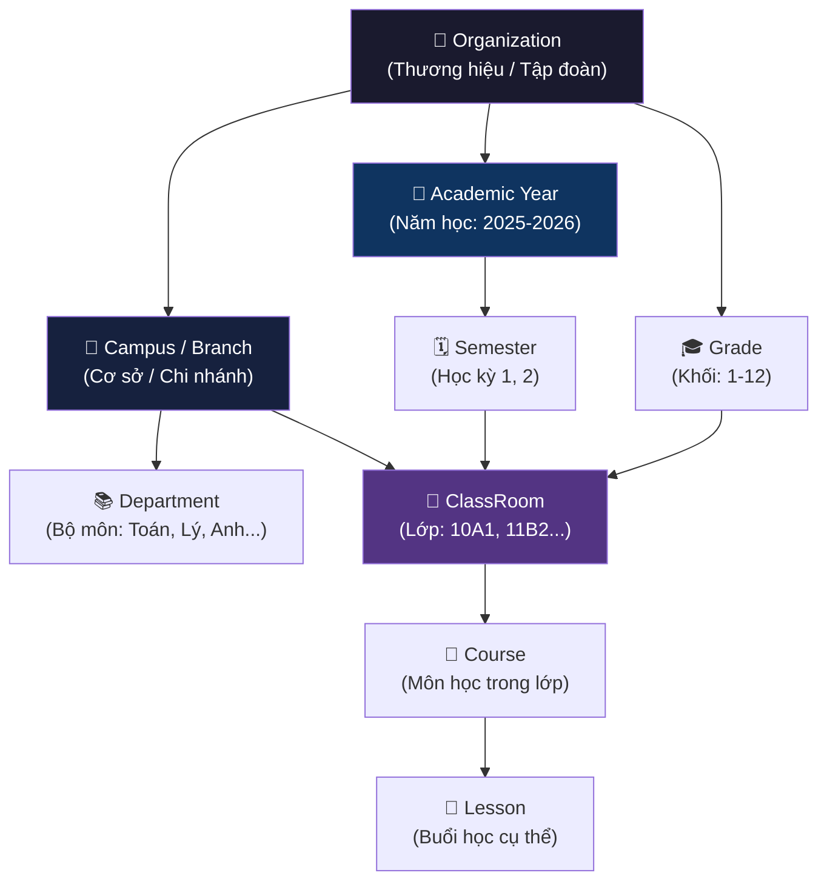

# AvaB EOS v2.0 — Information Architecture (Kiến trúc Thông tin)

> **Date:** 2026-07-04  
> **Version:** 2.0  
> **Status:** Architecture Planning

---

## 1. Data Hierarchy — Phân Cấp Dữ Liệu

Toàn bộ dữ liệu AvaB EOS được tổ chức theo cây phân cấp. Mỗi tầng là một **tenant scope** — dữ liệu tầng dưới thuộc tầng trên.



### Giải thích phân cấp

| Tầng | Scope | Ví dụ |
|------|-------|-------|
| Organization | Toàn hệ thống | "AvaB Education Group" |
| Campus | Địa lý / Cơ sở | "AvaB Quận 7", "AvaB Bình Thạnh" |
| Department | Chuyên môn | "Bộ môn Toán", "Bộ môn Tiếng Anh" |
| Academic Year | Thời gian | "2025-2026", "2026-2027" |
| Semester | Kỳ học | "HK1 2025-2026", "HK2 2025-2026" |
| Grade | Cấp lớp | "Khối 10", "Khối 11", "Lớp 5" |
| ClassRoom | Nhóm học | "10A1 - Toán nâng cao - Q7 - HK1" |
| Course | Môn trong lớp | "Đại số - GV Nguyễn Văn A" |
| Lesson | Buổi học | "Tiết 1, 07:00-08:30, Thứ 2" |

---

## 2. Workspace Map — Mỗi Role Thấy Gì

### 2.1 Super Admin (System-level)
```
Nhìn thấy: Tất cả Organizations, system config
Modules: All + System settings + Billing
Scope: Cross-org (platform admin)
```

### 2.2 Org Owner / CEO (Chủ trường)
```
Nhìn thấy: Toàn bộ Organization của mình
├── Tất cả Campus
├── Finance tổng (consolidated)
├── Analytics tổng
├── AI Decision Center
├── HRM (all staff)
└── CRM (all leads)
Scope: org-wide
```

### 2.3 Principal (Hiệu trưởng)
```
Nhìn thấy: Campus được phân công
├── Tất cả lớp trong campus
├── Tất cả GV trong campus
├── Finance campus (view only)
├── Analytics campus
├── TKB campus
└── Attendance campus
Scope: campus-scoped
```

### 2.4 Academic Director (Trưởng học vụ)
```
Nhìn thấy: Academic data của campus
├── Tất cả classes, courses, lessons
├── Teacher assignments
├── Curriculum progress
├── Academic calendar
└── AI Timetable (generate & edit)
Scope: campus-scoped, academic only
```

### 2.5 Department Head (Trưởng bộ môn)
```
Nhìn thấy: Department của mình
├── GV trong bộ môn
├── Các lớp bộ môn phụ trách
├── Curriculum của bộ môn
└── KPI GV trong bộ môn
Scope: department-scoped
```

### 2.6 Teacher (Giáo viên)
```
Nhìn thấy: Lớp học của mình
├── Danh sách học sinh trong lớp
├── Lịch dạy (TKB của mình)
├── Điểm danh (lớp mình phụ trách)
├── Bài tập & kết quả
└── Profile cá nhân, lương
Scope: assigned-classes only
```

### 2.7 Finance Staff (Kế toán)
```
Nhìn thấy: Finance module
├── Tất cả hóa đơn
├── Payments, Vouchers, Scholarships
├── Financial reports
└── Cash flow dashboard
Scope: campus-scoped finance
```

### 2.8 Sales / Tư vấn viên
```
Nhìn thấy: CRM module
├── Leads được assign
├── Pipeline của mình
├── Activities log
└── Campaign results
Scope: assigned-leads only (có thể xem all nếu senior)
```

### 2.9 HR Staff
```
Nhìn thấy: HRM module
├── Tất cả hồ sơ nhân viên
├── Timesheet, Leaves
├── Payroll processing
└── Recruitment
Scope: campus-scoped HR
```

### 2.10 Student (Học sinh)
```
Nhìn thấy: Portal cá nhân
├── Lịch học (TKB của mình)
├── Điểm danh lịch sử
├── Tiến độ học tập
├── Học phí & hóa đơn (view only)
└── Missions, XP, gamification
Scope: self only
```

### 2.11 Parent (Phụ huynh)
```
Nhìn thấy: Thông tin con cái
├── Điểm danh của con
├── Tiến độ học tập của con
├── Lịch học của con
├── Học phí / thanh toán
└── Thông báo từ trường
Scope: linked-children only
```

---

## 3. Content Hierarchy Mỗi Module

### 3.1 School ERP

```
School ERP
├── Students
│   ├── List View (table, filter by class/grade/campus)
│   ├── Student Detail
│   │   ├── Profile (thông tin cá nhân, gia đình)
│   │   ├── Academic (lớp hiện tại, lịch sử lớp, kết quả)
│   │   ├── Attendance (lịch sử điểm danh, thống kê)
│   │   ├── Finance (hóa đơn, thanh toán liên quan)
│   │   ├── Health (sức khỏe, dị ứng, bệnh lý)
│   │   ├── Rewards/Discipline (khen thưởng, kỷ luật)
│   │   └── Documents (hồ sơ nhập học, CMT, ảnh)
│   └── Transfers (chuyển campus, lịch sử)
│
├── Teachers
│   ├── List View
│   ├── Teacher Detail
│   │   ├── Profile (chuyên môn, chứng chỉ)
│   │   ├── Schedule (lịch dạy hiện tại)
│   │   ├── Classes (các lớp phụ trách)
│   │   ├── Performance (KPI, đánh giá)
│   │   └── Documents (hợp đồng, bằng cấp)
│   └── Assignments (phân công lớp)
│
├── Classes (ClassRooms)
│   ├── List View (filter by campus/grade/semester)
│   ├── Class Detail
│   │   ├── Students (danh sách HS trong lớp)
│   │   ├── Schedule (TKB lớp)
│   │   ├── Attendance (log điểm danh)
│   │   └── Results (kết quả học tập)
│
├── Rooms
│   ├── List (filter by campus/type/capacity)
│   ├── Room Detail (thông tin, thiết bị trong phòng)
│   └── Availability Calendar (lịch sử dụng phòng)
│
└── Attendance
    ├── Today View (điểm danh hôm nay theo lớp)
    ├── History (lịch sử, filter)
    └── Reports (báo cáo vắng, trễ, thống kê)
```

### 3.2 Finance ERP

```
Finance ERP
├── Dashboard
│   ├── KPIs (doanh thu, công nợ, đã thu, tỷ lệ thu)
│   ├── Revenue Chart (theo tháng, theo campus)
│   ├── Pending Invoices
│   └── Recent Payments
│
├── Invoices
│   ├── List (filter: status, dueDate, student, campus)
│   ├── Invoice Detail
│   │   ├── Line items (học phí, tài liệu, đồng phục...)
│   │   ├── Applied voucher/scholarship
│   │   ├── Payment history
│   │   └── Installment schedule (nếu có)
│   └── Overdue (quá hạn, cần xử lý)
│
├── Tuition Packages
│   ├── Package List (gói học phí chuẩn)
│   └── Package Detail (môn học, giá, thời hạn)
│
├── Vouchers
│   ├── List (active/expired/paused)
│   ├── Voucher Detail (điều kiện áp dụng, usage stats)
│   └── Generate bulk
│
└── Reports
    ├── Revenue (doanh thu theo kỳ, cơ sở, gói)
    ├── Cash Flow (dòng tiền thực tế)
    ├── Forecast (dự báo doanh thu tháng tới)
    └── Outstanding (công nợ chi tiết)
```

### 3.3 CRM

```
CRM
├── Dashboard
│   ├── Pipeline Overview (số lead mỗi stage)
│   ├── Conversion Funnel
│   ├── Today's Tasks
│   └── Team Performance
│
├── Leads
│   ├── List (filter: stage, assignee, source, campus)
│   └── Lead Detail
│       ├── Contact info (tên, SĐT, email, con)
│       ├── Pipeline history (lịch sử di chuyển stage)
│       ├── Activities (calls, emails, notes)
│       ├── Next action + due date
│       └── Linked student (sau khi đăng ký)
│
├── Pipeline (Kanban)
│   └── Stages: New Lead → Contacted → Trial → Enrolled → Active → Renewing → Alumni
│
└── Campaigns
    ├── List (Facebook Ads, Zalo OA, Referral...)
    ├── Campaign Detail (target, budget, leads generated, conversion rate)
    └── Analytics (ROI per campaign)
```

---

## 4. Navigation Patterns

### 4.1 Side Navigation (Primary)

```
┌──────────────────────────┐
│  🏢 AvaB [Campus: Q7 ▼]  │ ← Campus switcher (Multi-campus)
├──────────────────────────┤
│  📊 Dashboard            │
├──────────────────────────┤
│  ACADEMIC                │
│  👥 School ERP    →      │ ← Expandable sub-menu
│    ├ Học sinh            │
│    ├ Giáo viên           │
│    ├ Lớp học             │
│    └ Điểm danh           │
│  🕐 AI Timetable         │
│  📅 Academic Calendar    │
├──────────────────────────┤
│  BUSINESS                │
│  💰 Finance ERP   →      │
│  📞 CRM           →      │
│  👔 HRM           →      │
│  🤝 Collaboration →      │
├──────────────────────────┤
│  INTELLIGENCE            │
│  📈 Analytics Center     │
│  🤖 AI Decision Center   │
├──────────────────────────┤
│  PLATFORM                │
│  🔌 App Center           │
│  ⚙️  Settings            │
└──────────────────────────┘
```

**Side Nav Behaviors:**
- Collapsible (icon-only mode cho màn nhỏ)
- Active state highlight
- Badge count cho alerts/tasks
- Campus switcher ở top

### 4.2 Breadcrumb (Secondary Navigation)

```
Pattern: [Module] > [Section] > [Item Name]

Ví dụ:
School ERP > Học sinh > Nguyễn Văn An > Điểm danh

Finance ERP > Hóa đơn > #INV-2026-001 > Lịch sử thanh toán

AI Timetable > Phiên bản #3 > Review conflicts
```

**Breadcrumb Rules:**
- Max 4 levels
- Click để navigate lên bất kỳ cấp nào
- Last item = current (không clickable)
- Mobile: show last 2 levels only

### 4.3 Tab Navigation (Tertiary — Detail Pages)

```
Student Detail Tabs:
[Profile] [Academic] [Điểm danh] [Tài chính] [Sức khỏe] [Khen thưởng] [Tài liệu]
   ↑ active tab underlined

Teacher Detail Tabs:
[Profile] [Lịch dạy] [Lớp phụ trách] [Hiệu suất] [Tài liệu]

Invoice Detail Tabs:
[Chi tiết] [Lịch sử thanh toán] [Trả góp] [Ghi chú]
```

### 4.4 Filter & Search Patterns

```
Global Search (cmd+K):
- Tìm kiếm cross-module: student, teacher, invoice, lead...
- Recent items
- Quick actions

Module-level Filter:
┌──────────────────────────────────────────────────────┐
│  🔍 Tìm tên, SĐT...   │ Campus ▼ │ Lớp ▼ │ Trạng thái ▼ │
└──────────────────────────────────────────────────────┘
  + Advanced filters (date range, amount range, etc.)

Active Filters (chips):
[Campus: Q7 ×] [Lớp: 10A1 ×] [Trạng thái: Đang học ×] [Clear all]
```

### 4.5 Context Actions

```
List View Actions:
- Row hover: Quick action buttons (View, Edit, ...)
- Checkbox select: Bulk actions (Export, Assign, Delete)
- Right-click context menu (optional)

Detail View Actions:
- Primary action button (Edit / Save)
- Secondary actions (Export PDF, Print, Share link)
- Danger zone (Delete, Transfer, Archive) — separated at bottom
```

---

## 5. Cross-Module Linkages

Đây là điểm khác biệt của EOS — data liên kết xuyên module:

```
Student Profile
├── → Finance: Xem hóa đơn học phí của học sinh này
├── → CRM: Xem lead đầu vào của học sinh này
├── → Attendance: Lịch sử điểm danh
└── → Academic: Tiến độ học tập

Invoice
├── → Student: Học sinh liên quan
├── → Finance Package: Gói học phí áp dụng
└── → Payment: Lịch sử thanh toán

Teacher
├── → Timetable: TKB của GV này
├── → Classes: Các lớp phụ trách
└── → HRM: Hợp đồng, lương, KPI

Lead (CRM)
└── → Student: Sau khi convert, link đến hồ sơ học sinh
```

---

## 6. Empty States & Error States

### Empty States (Không có data)
```
[Icon minh họa]
"Chưa có [tên entity] nào"
"[Lý do và hướng dẫn bước tiếp theo]"
[Button: Thêm mới / Import]
```

### Error States
```
404 - Not Found:
  "Không tìm thấy [entity] này"
  Có thể đã bị xóa hoặc bạn không có quyền truy cập

403 - Forbidden:
  "Bạn không có quyền xem trang này"
  Liên hệ Admin để được cấp quyền

500 - Server Error:
  "Có lỗi xảy ra. Vui lòng thử lại"
  [Retry button] [Report issue]
```

---

## 7. Notification & Alert Architecture

```
Alert Priority Levels:

🔴 CRITICAL (immediate)  → In-app banner + Push notification + Email
   Ví dụ: Payment failed, System down

🟠 HIGH (same day)       → In-app notification + Push
   Ví dụ: Invoice overdue 30 ngày, Học sinh vắng 3 buổi liên tiếp

🟡 MEDIUM (next login)   → In-app notification badge
   Ví dụ: Lead chưa follow-up 7 ngày, KPI sắp đến deadline

🔵 INFO (background)     → In-app feed only
   Ví dụ: TKB đã được publish, Hóa đơn mới được tạo
```

---

*Document prepared by AvaB Architecture Team — 2026-07-04*
