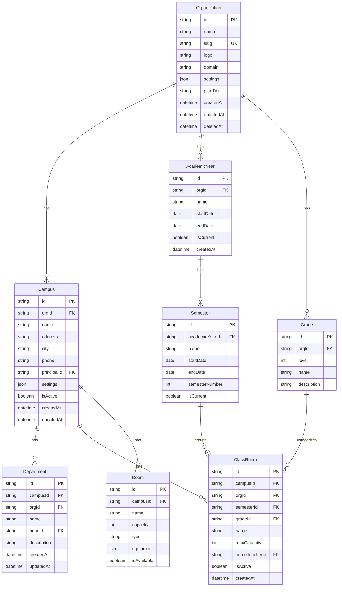
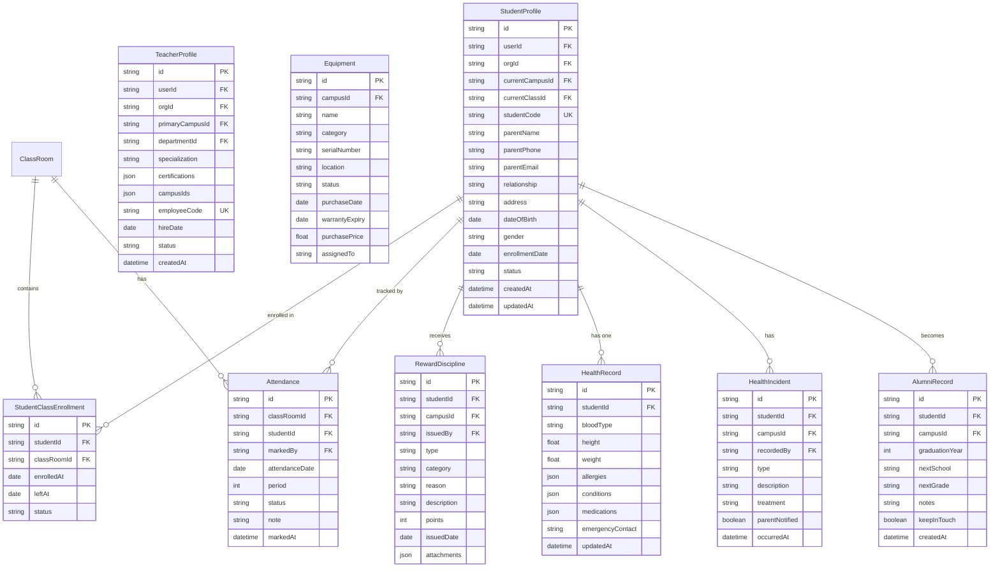
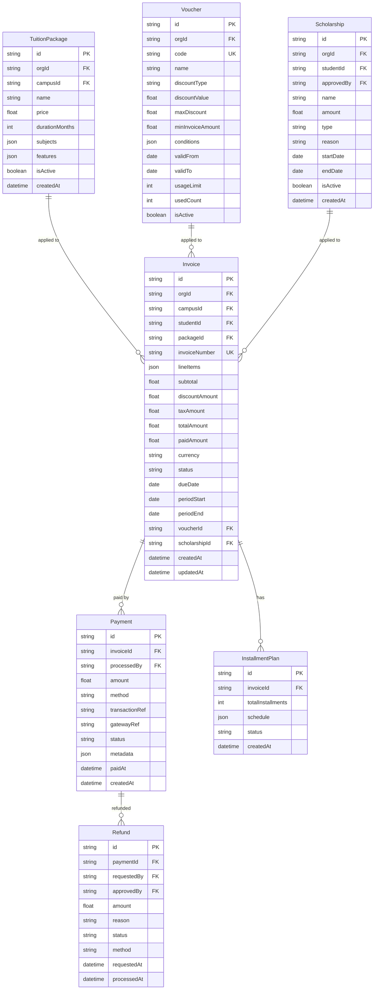
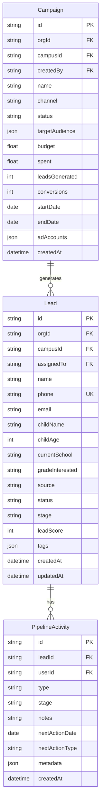
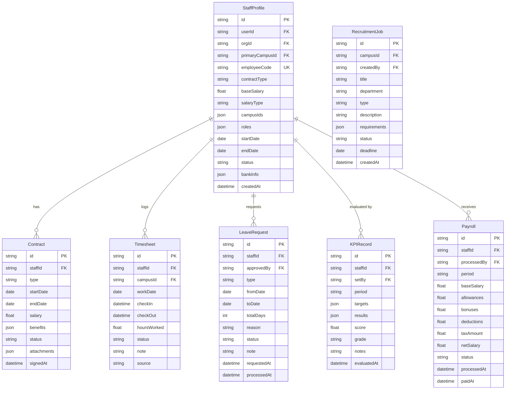
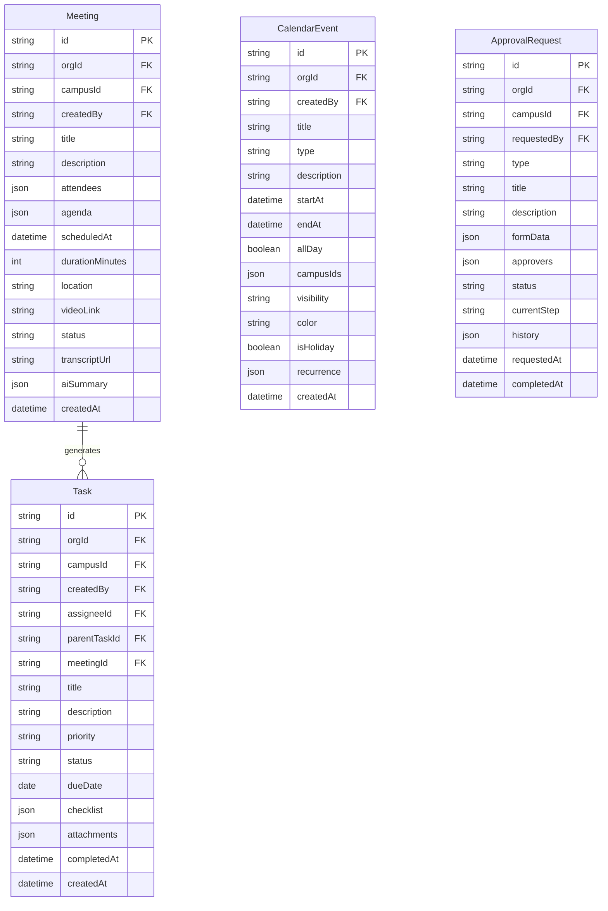
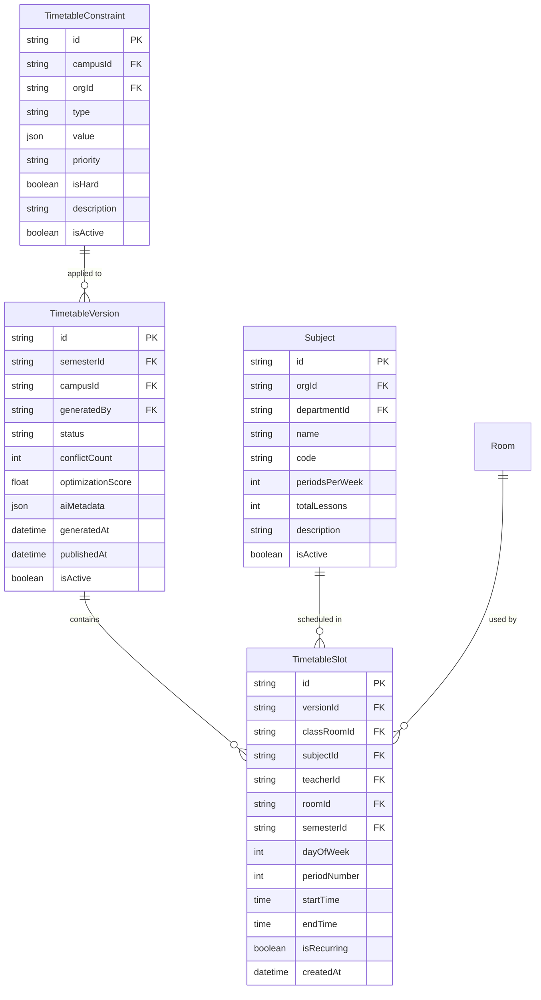

# AvaB EOS v2.0 — Database ERD (Entity Relationship Diagram)

> **Date:** 2026-07-04  
> **Version:** 2.0  
> **Status:** Architecture Planning

---

## 1. Ghi Chú Thiết Kế

- **Database:** PostgreSQL với Prisma ORM
- **Multi-tenancy:** Row-level tenancy (orgId trên mọi bảng)
- **Soft delete:** `deletedAt` timestamp thay vì DELETE thực
- **Audit:** `createdAt`, `updatedAt`, `createdBy`, `updatedBy` trên mọi bảng
- **Tránh reserved words:** `ClassRoom` thay vì `Class`

---

## 2. ERD — Core Organization



---

## 3. ERD — School ERP



---

## 4. ERD — Finance ERP



---

## 5. ERD — CRM



---

## 6. ERD — HRM



---

## 7. ERD — Collaboration



---

## 8. ERD — AI Timetable Engine



---

## 9. Key Design Decisions

### Multi-Campus Data Isolation
```sql
-- Mọi query đều filter theo orgId và/hoặc campusId
SELECT * FROM "StudentProfile" 
WHERE "orgId" = :orgId 
  AND "currentCampusId" = :campusId
  AND "deletedAt" IS NULL;
```

### Soft Delete Pattern
```sql
-- Không xóa thật, chỉ đánh dấu
UPDATE "StudentProfile" 
SET "deletedAt" = NOW(), "updatedBy" = :userId
WHERE id = :id AND "orgId" = :orgId;
```

### Audit Trail
```sql
-- Mọi bảng đều có
createdAt    TIMESTAMP NOT NULL DEFAULT NOW()
updatedAt    TIMESTAMP NOT NULL
createdBy    VARCHAR REFERENCES "User"(id)
updatedBy    VARCHAR REFERENCES "User"(id)
deletedAt    TIMESTAMP  -- null = active
```

### Indexes Quan Trọng
```sql
-- Student lookup
CREATE INDEX idx_student_org_campus ON "StudentProfile"(orgId, currentCampusId);
CREATE INDEX idx_student_class ON "StudentProfile"(currentClassId);

-- Attendance
CREATE INDEX idx_attendance_class_date ON "Attendance"(classRoomId, attendanceDate);

-- Invoice
CREATE INDEX idx_invoice_student ON "Invoice"(studentId, status);
CREATE INDEX idx_invoice_due ON "Invoice"(dueDate, status) WHERE status != 'paid';

-- Lead
CREATE INDEX idx_lead_stage ON "Lead"(orgId, campusId, stage);
CREATE INDEX idx_lead_assigned ON "Lead"(assignedTo, stage);
```

---

*Document prepared by AvaB Architecture Team — 2026-07-04*
