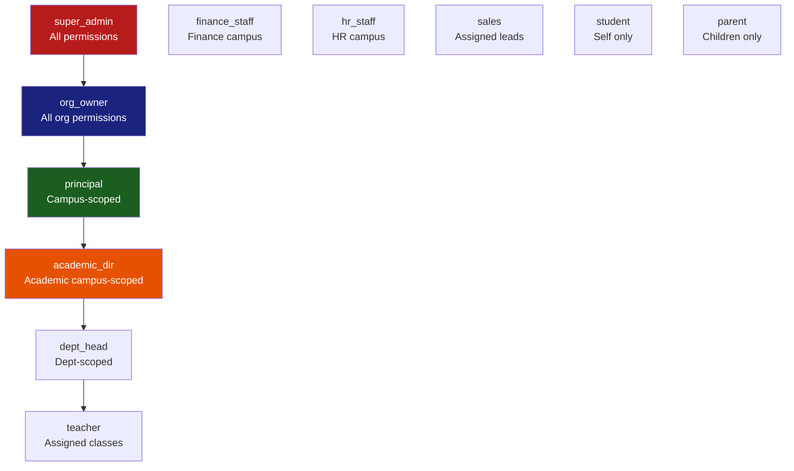

# AvaB EOS v2.0 — RBAC Permission Matrix

> **Date:** 2026-07-04  
> **Version:** 2.0  
> **Status:** Architecture Planning

---

## 1. Roles Definition

| Role | Mô tả | Scope |
|------|-------|-------|
| **super_admin** | Platform administrator (AvaB team) | System-wide |
| **org_owner** | Chủ trường / CEO / Owner | Org-wide |
| **principal** | Hiệu trưởng cơ sở | Campus-scoped |
| **academic_dir** | Trưởng học vụ | Campus-scoped |
| **dept_head** | Trưởng bộ môn | Department-scoped |
| **teacher** | Giáo viên | Assigned-classes |
| **finance_staff** | Kế toán / Thu ngân | Campus-scoped |
| **hr_staff** | Nhân sự | Campus-scoped |
| **sales** | Tư vấn tuyển sinh / Sales | Assigned-leads |
| **student** | Học sinh | Self |
| **parent** | Phụ huynh | Linked-children |

---

## 2. Permission Naming Convention

```
{module}.{resource}.{action}

Ví dụ:
  erp.student.view       ← Xem danh sách học sinh
  erp.student.edit       ← Chỉnh sửa thông tin học sinh
  finance.invoice.create ← Tạo hóa đơn mới
  ai.timetable.generate  ← Chạy AI generate TKB
```

---

## 3. Permission Matrix

### Legend: ✅ Full | 👁 View Only | 🔒 Restricted | — Not Accessible

### 3.1 School ERP Permissions

| Permission | Super Admin | Org Owner | Principal | Academic Dir | Dept Head | Teacher | Finance | HR | Sales | Student | Parent |
|-----------|:-----------:|:---------:|:---------:|:------------:|:---------:|:-------:|:-------:|:--:|:-----:|:-------:|:------:|
| **erp.student.view** | ✅ | ✅ | ✅ | ✅ | 👁 | 🔒¹ | 👁 | 👁 | 👁 | 🔒² | 🔒³ |
| **erp.student.create** | ✅ | ✅ | ✅ | ✅ | — | — | — | — | — | — | — |
| **erp.student.edit** | ✅ | ✅ | ✅ | ✅ | — | — | — | — | — | — | — |
| **erp.student.delete** | ✅ | ✅ | — | — | — | — | — | — | — | — | — |
| **erp.student.transfer** | ✅ | ✅ | ✅ | — | — | — | — | — | — | — | — |
| **erp.student.import** | ✅ | ✅ | ✅ | ✅ | — | — | — | — | — | — | — |
| **erp.student.export** | ✅ | ✅ | ✅ | ✅ | 👁 | — | 👁 | 👁 | — | — | — |
| **erp.teacher.view** | ✅ | ✅ | ✅ | ✅ | ✅ | — | 👁 | ✅ | — | — | — |
| **erp.teacher.create** | ✅ | ✅ | ✅ | — | — | — | — | ✅ | — | — | — |
| **erp.teacher.edit** | ✅ | ✅ | ✅ | — | — | — | — | ✅ | — | — | — |
| **erp.class.view** | ✅ | ✅ | ✅ | ✅ | ✅ | 🔒¹ | 👁 | 👁 | — | 🔒² | 🔒³ |
| **erp.class.create** | ✅ | ✅ | ✅ | ✅ | — | — | — | — | — | — | — |
| **erp.class.edit** | ✅ | ✅ | ✅ | ✅ | — | — | — | — | — | — | — |
| **erp.class.delete** | ✅ | ✅ | ✅ | — | — | — | — | — | — | — | — |
| **erp.timetable.view** | ✅ | ✅ | ✅ | ✅ | ✅ | ✅ | — | — | — | ✅ | ✅ |
| **erp.timetable.generate** | ✅ | ✅ | ✅ | ✅ | — | — | — | — | — | — | — |
| **erp.timetable.edit** | ✅ | ✅ | ✅ | ✅ | — | — | — | — | — | — | — |
| **erp.timetable.publish** | ✅ | ✅ | ✅ | — | — | — | — | — | — | — | — |
| **erp.attendance.view** | ✅ | ✅ | ✅ | ✅ | ✅ | 🔒¹ | — | — | — | 🔒² | 🔒³ |
| **erp.attendance.mark** | ✅ | ✅ | ✅ | ✅ | — | 🔒¹ | — | — | — | — | — |
| **erp.attendance.edit** | ✅ | ✅ | ✅ | ✅ | — | — | — | — | — | — | — |
| **erp.room.view** | ✅ | ✅ | ✅ | ✅ | ✅ | ✅ | — | — | — | — | — |
| **erp.room.manage** | ✅ | ✅ | ✅ | ✅ | — | — | — | — | — | — | — |
| **erp.equipment.view** | ✅ | ✅ | ✅ | ✅ | ✅ | ✅ | — | — | — | — | — |
| **erp.equipment.manage** | ✅ | ✅ | ✅ | — | — | — | — | — | — | — | — |
| **erp.health.view** | ✅ | ✅ | ✅ | 👁 | — | 🔒¹ | — | — | — | 🔒² | 🔒³ |
| **erp.health.edit** | ✅ | ✅ | ✅ | — | — | — | — | — | — | — | — |
| **erp.rewards.view** | ✅ | ✅ | ✅ | ✅ | ✅ | 🔒¹ | — | — | — | 🔒² | 🔒³ |
| **erp.rewards.create** | ✅ | ✅ | ✅ | ✅ | ✅ | — | — | — | — | — | — |
| **erp.alumni.view** | ✅ | ✅ | ✅ | ✅ | — | — | — | — | ✅ | — | — |
| **erp.alumni.manage** | ✅ | ✅ | ✅ | ✅ | — | — | — | — | — | — | — |

*¹ Chỉ lớp được phân công  ²  Chỉ bản thân  ³ Chỉ con cái*

---

### 3.2 Finance ERP Permissions

| Permission | Super Admin | Org Owner | Principal | Academic Dir | Dept Head | Teacher | Finance | HR | Sales | Student | Parent |
|-----------|:-----------:|:---------:|:---------:|:------------:|:---------:|:-------:|:-------:|:--:|:-----:|:-------:|:------:|
| **finance.invoice.view** | ✅ | ✅ | 👁 | — | — | — | ✅ | — | — | 🔒² | 🔒³ |
| **finance.invoice.create** | ✅ | ✅ | — | — | — | — | ✅ | — | — | — | — |
| **finance.invoice.edit** | ✅ | ✅ | — | — | — | — | ✅ | — | — | — | — |
| **finance.invoice.delete** | ✅ | ✅ | — | — | — | — | — | — | — | — | — |
| **finance.payment.view** | ✅ | ✅ | 👁 | — | — | — | ✅ | — | — | 🔒² | 🔒³ |
| **finance.payment.process** | ✅ | ✅ | — | — | — | — | ✅ | — | — | — | — |
| **finance.refund.view** | ✅ | ✅ | 👁 | — | — | — | ✅ | — | — | — | — |
| **finance.refund.process** | ✅ | ✅ | — | — | — | — | ✅ | — | — | — | — |
| **finance.package.view** | ✅ | ✅ | 👁 | — | — | — | ✅ | — | ✅ | — | — |
| **finance.package.manage** | ✅ | ✅ | — | — | — | — | ✅ | — | — | — | — |
| **finance.voucher.view** | ✅ | ✅ | 👁 | — | — | — | ✅ | — | ✅ | — | — |
| **finance.voucher.manage** | ✅ | ✅ | — | — | — | — | ✅ | — | — | — | — |
| **finance.scholarship.view** | ✅ | ✅ | ✅ | 👁 | — | — | ✅ | — | — | 🔒² | — |
| **finance.scholarship.manage** | ✅ | ✅ | ✅ | — | — | — | ✅ | — | — | — | — |
| **finance.installment.view** | ✅ | ✅ | 👁 | — | — | — | ✅ | — | — | 🔒² | 🔒³ |
| **finance.installment.manage** | ✅ | ✅ | — | — | — | — | ✅ | — | — | — | — |
| **finance.report.view** | ✅ | ✅ | 👁 | — | — | — | ✅ | — | — | — | — |
| **finance.report.export** | ✅ | ✅ | — | — | — | — | ✅ | — | — | — | — |
| **finance.cashflow.view** | ✅ | ✅ | — | — | — | — | ✅ | — | — | — | — |
| **finance.forecast.view** | ✅ | ✅ | — | — | — | — | ✅ | — | — | — | — |

---

### 3.3 CRM Permissions

| Permission | Super Admin | Org Owner | Principal | Academic Dir | Dept Head | Teacher | Finance | HR | Sales | Student | Parent |
|-----------|:-----------:|:---------:|:---------:|:------------:|:---------:|:-------:|:-------:|:--:|:-----:|:-------:|:------:|
| **crm.lead.view** | ✅ | ✅ | 👁 | — | — | — | — | — | 🔒⁴ | — | — |
| **crm.lead.create** | ✅ | ✅ | ✅ | — | — | — | — | — | ✅ | — | — |
| **crm.lead.edit** | ✅ | ✅ | ✅ | — | — | — | — | — | 🔒⁴ | — | — |
| **crm.lead.delete** | ✅ | ✅ | — | — | — | — | — | — | — | — | — |
| **crm.lead.assign** | ✅ | ✅ | ✅ | — | — | — | — | — | — | — | — |
| **crm.lead.view_all** | ✅ | ✅ | ✅ | — | — | — | — | — | — | — | — |
| **crm.pipeline.view** | ✅ | ✅ | ✅ | — | — | — | — | — | ✅ | — | — |
| **crm.pipeline.manage** | ✅ | ✅ | ✅ | — | — | — | — | — | 🔒⁴ | — | — |
| **crm.campaign.view** | ✅ | ✅ | ✅ | — | — | — | — | — | 👁 | — | — |
| **crm.campaign.create** | ✅ | ✅ | ✅ | — | — | — | — | — | — | — | — |
| **crm.campaign.edit** | ✅ | ✅ | ✅ | — | — | — | — | — | — | — | — |
| **crm.report.view** | ✅ | ✅ | ✅ | — | — | — | — | — | 👁 | — | — |

*⁴ Chỉ leads được assign cho mình*

---

### 3.4 HRM Permissions

| Permission | Super Admin | Org Owner | Principal | Academic Dir | Dept Head | Teacher | Finance | HR | Sales | Student | Parent |
|-----------|:-----------:|:---------:|:---------:|:------------:|:---------:|:-------:|:-------:|:--:|:-----:|:-------:|:------:|
| **hrm.staff.view** | ✅ | ✅ | ✅ | 👁 | 👁 | 🔒² | — | ✅ | 🔒² | — | — |
| **hrm.staff.create** | ✅ | ✅ | ✅ | — | — | — | — | ✅ | — | — | — |
| **hrm.staff.edit** | ✅ | ✅ | ✅ | — | — | — | — | ✅ | — | — | — |
| **hrm.staff.delete** | ✅ | ✅ | — | — | — | — | — | — | — | — | — |
| **hrm.contract.view** | ✅ | ✅ | ✅ | — | — | 🔒² | — | ✅ | — | — | — |
| **hrm.contract.manage** | ✅ | ✅ | ✅ | — | — | — | — | ✅ | — | — | — |
| **hrm.timesheet.view** | ✅ | ✅ | ✅ | 👁 | 👁 | 🔒² | — | ✅ | 🔒² | — | — |
| **hrm.timesheet.edit** | ✅ | ✅ | ✅ | — | — | — | — | ✅ | — | — | — |
| **hrm.leave.view** | ✅ | ✅ | ✅ | 👁 | 👁 | 🔒² | — | ✅ | 🔒² | — | — |
| **hrm.leave.request** | ✅ | ✅ | ✅ | ✅ | ✅ | ✅ | ✅ | ✅ | ✅ | — | — |
| **hrm.leave.approve** | ✅ | ✅ | ✅ | ✅ | — | — | — | ✅ | — | — | — |
| **hrm.kpi.view** | ✅ | ✅ | ✅ | ✅ | ✅ | 🔒² | — | ✅ | — | — | — |
| **hrm.kpi.set** | ✅ | ✅ | ✅ | ✅ | ✅ | — | — | ✅ | — | — | — |
| **hrm.kpi.review** | ✅ | ✅ | ✅ | ✅ | ✅ | — | — | ✅ | — | — | — |
| **hrm.payroll.view** | ✅ | ✅ | — | — | — | 🔒² | — | ✅ | 🔒² | — | — |
| **hrm.payroll.process** | ✅ | ✅ | — | — | — | — | — | ✅ | — | — | — |
| **hrm.recruitment.view** | ✅ | ✅ | ✅ | 👁 | 👁 | — | — | ✅ | — | — | — |
| **hrm.recruitment.manage** | ✅ | ✅ | ✅ | — | — | — | — | ✅ | — | — | — |

---

### 3.5 Collaboration Permissions

| Permission | Super Admin | Org Owner | Principal | Academic Dir | Dept Head | Teacher | Finance | HR | Sales | Student | Parent |
|-----------|:-----------:|:---------:|:---------:|:------------:|:---------:|:-------:|:-------:|:--:|:-----:|:-------:|:------:|
| **collab.calendar.view** | ✅ | ✅ | ✅ | ✅ | ✅ | ✅ | ✅ | ✅ | ✅ | ✅ | ✅ |
| **collab.calendar.manage** | ✅ | ✅ | ✅ | ✅ | — | — | — | — | — | — | — |
| **collab.meeting.view** | ✅ | ✅ | ✅ | ✅ | ✅ | 🔒⁵ | 🔒⁵ | 🔒⁵ | — | — | — |
| **collab.meeting.create** | ✅ | ✅ | ✅ | ✅ | ✅ | ✅ | ✅ | ✅ | — | — | — |
| **collab.meeting.transcript** | ✅ | ✅ | ✅ | ✅ | ✅ | 🔒⁵ | 🔒⁵ | 🔒⁵ | — | — | — |
| **collab.task.view** | ✅ | ✅ | ✅ | ✅ | ✅ | 🔒⁵ | 🔒⁵ | 🔒⁵ | 🔒⁵ | — | — |
| **collab.task.create** | ✅ | ✅ | ✅ | ✅ | ✅ | ✅ | ✅ | ✅ | ✅ | — | — |
| **collab.task.assign** | ✅ | ✅ | ✅ | ✅ | ✅ | — | — | — | — | — | — |
| **collab.approval.view** | ✅ | ✅ | ✅ | ✅ | ✅ | 🔒⁵ | 🔒⁵ | 🔒⁵ | 🔒⁵ | — | — |
| **collab.approval.create** | ✅ | ✅ | ✅ | ✅ | ✅ | ✅ | ✅ | ✅ | ✅ | — | — |
| **collab.approval.process** | ✅ | ✅ | ✅ | ✅ | — | — | — | — | — | — | — |

*⁵ Chỉ cuộc họp/task có mình tham gia*

---

### 3.6 Analytics & AI Permissions

| Permission | Super Admin | Org Owner | Principal | Academic Dir | Dept Head | Teacher | Finance | HR | Sales | Student | Parent |
|-----------|:-----------:|:---------:|:---------:|:------------:|:---------:|:-------:|:-------:|:--:|:-----:|:-------:|:------:|
| **analytics.org.view** | ✅ | ✅ | — | — | — | — | — | — | — | — | — |
| **analytics.campus.view** | ✅ | ✅ | ✅ | 👁 | — | — | ✅ | ✅ | — | — | — |
| **analytics.students.view** | ✅ | ✅ | ✅ | ✅ | 👁 | 🔒¹ | — | — | — | 🔒² | — |
| **analytics.finance.view** | ✅ | ✅ | 👁 | — | — | — | ✅ | — | — | — | — |
| **analytics.hrm.view** | ✅ | ✅ | ✅ | — | — | — | — | ✅ | — | — | — |
| **analytics.crm.view** | ✅ | ✅ | ✅ | — | — | — | — | — | 👁 | — | — |
| **analytics.export** | ✅ | ✅ | ✅ | 👁 | — | — | ✅ | ✅ | — | — | — |
| **analytics.custom** | ✅ | ✅ | — | — | — | — | — | — | — | — | — |
| **ai.timetable.generate** | ✅ | ✅ | ✅ | ✅ | — | — | — | — | — | — | — |
| **ai.timetable.edit** | ✅ | ✅ | ✅ | ✅ | — | — | — | — | — | — | — |
| **ai.timetable.publish** | ✅ | ✅ | ✅ | — | — | — | — | — | — | — | — |
| **ai.decision.view** | ✅ | ✅ | ✅ | 👁 | — | — | 👁 | 👁 | — | — | — |
| **ai.decision.configure** | ✅ | ✅ | — | — | — | — | — | — | — | — | — |
| **ai.meeting.transcript** | ✅ | ✅ | ✅ | ✅ | ✅ | 🔒⁵ | — | — | — | — | — |
| **platform.app.install** | ✅ | ✅ | — | — | — | — | — | — | — | — | — |
| **platform.api.manage** | ✅ | ✅ | — | — | — | — | — | — | — | — | — |
| **platform.webhook.manage** | ✅ | ✅ | — | — | — | — | — | — | — | — | — |

---

## 4. Role Hierarchy & Inheritance



---

## 5. Dynamic Permissions (Context-Aware)

Một số permissions chỉ áp dụng trong context nhất định:

```typescript
// Ví dụ: Teacher chỉ mark attendance cho lớp của mình
canMarkAttendance(userId: string, classId: string): boolean {
  return db.ClassRoom.exists({
    id: classId,
    homeTeacherId: userId  // hoặc assigned teacher
  });
}

// Sales chỉ edit lead được assign cho mình
canEditLead(userId: string, leadId: string): boolean {
  return db.Lead.exists({
    id: leadId,
    assignedTo: userId
  }) || hasRole(userId, 'org_owner', 'principal');
}

// Principal chỉ thấy data của campus mình
getCampusScope(userId: string): string[] {
  return db.Campus.findMany({
    where: { principalId: userId }
  }).map(c => c.id);
}
```

---

## 6. Permission Middleware (Backend)

```typescript
// Middleware kiểm tra permission
@UseGuards(PermissionGuard)
@RequirePermission('erp.student.edit')
@RequireCampusScope() // Tự động filter theo campusId của user
async updateStudent(id: string, dto: UpdateStudentDto) {
  // ...
}

// Role-based access ở query level
async getStudents(user: User, campusId: string) {
  if (user.roles.includes('org_owner')) {
    return db.StudentProfile.findMany({ where: { orgId: user.orgId } });
  }
  if (user.roles.includes('principal')) {
    return db.StudentProfile.findMany({ 
      where: { orgId: user.orgId, currentCampusId: campusId } 
    });
  }
  if (user.roles.includes('teacher')) {
    return db.StudentProfile.findMany({
      where: { 
        orgId: user.orgId,
        currentClassId: { in: user.assignedClassIds }
      }
    });
  }
}
```

---

*Document prepared by AvaB Architecture Team — 2026-07-04*
