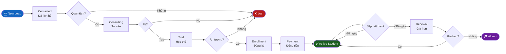
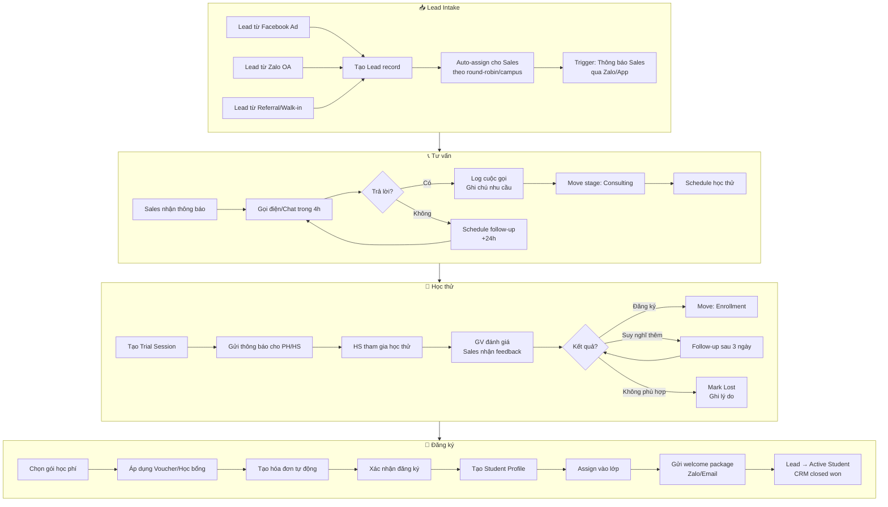
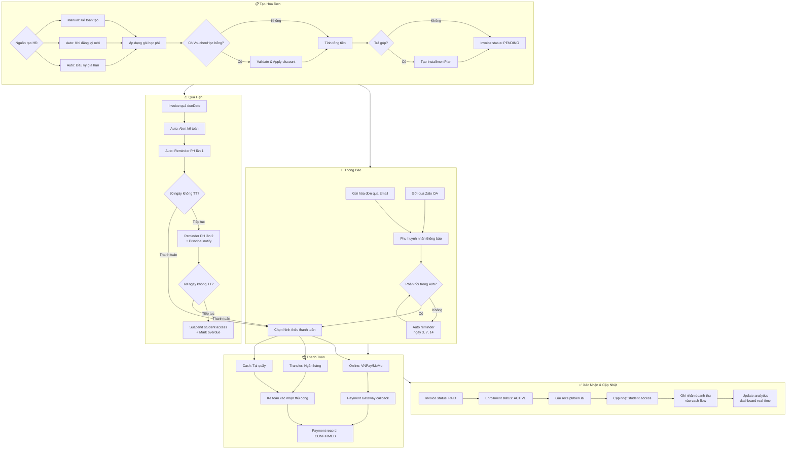
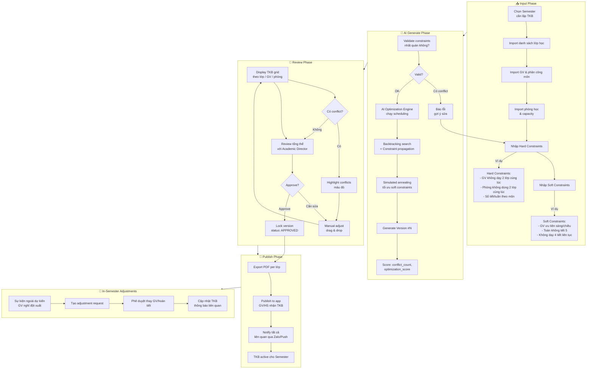
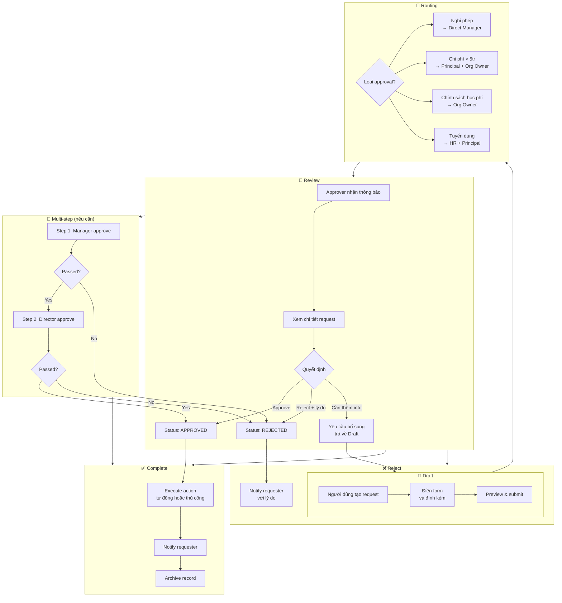
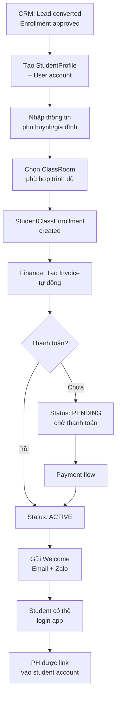
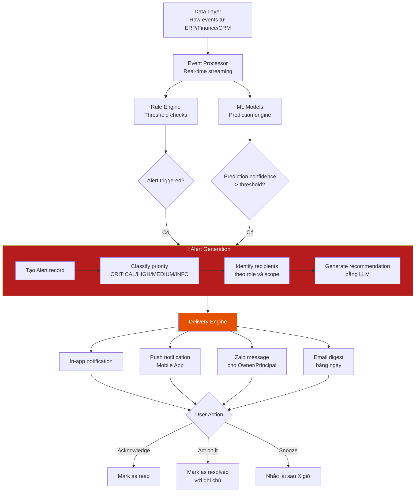

# AvaB EOS v2.0 — Workflow Per Module (Quy trình từng Module)

> **Date:** 2026-07-04  
> **Version:** 2.0  
> **Status:** Architecture Planning

---

## 1. CRM Workflow — Lead đến Alumni

### 1.1 Stages Pipeline



### 1.2 Detailed CRM Flow



---

## 2. Finance Workflow — Tạo đến Ghi nhận Doanh thu



---

## 3. AI Timetable Workflow



---

## 4. Approval Workflow — Luồng Phê Duyệt



---

## 5. HRM Workflow — Từ Tuyển Dụng đến Lương

```mermaid
flowchart TD
    subgraph RECRUIT["🔍 Tuyển Dụng"]
        REC1[Xác định nhu cầu\nnhân sự] --> REC2[Tạo Job Posting]
        REC2 --> REC3[Publish: Website,\nFacebook, Vietnamworks]
        REC3 --> REC4[Thu hồ sơ ứng viên]
        REC4 --> REC5[HR sàng lọc hồ sơ]
        REC5 --> REC6[Phỏng vấn vòng 1\nHR + Technical]
        REC6 --> REC7{Passed?}
        REC7 -->|Không| REC8[Reject + notify]
        REC7 -->|Có| REC9[Phỏng vấn vòng 2\nPrincipal]
        REC9 --> REC10{Hired?}
        REC10 -->|Không| REC8
        REC10 -->|Có| ONB1
    end

    subgraph ONBOARD["🚀 Onboarding"]
        ONB1[Tạo Staff Profile\n+ User account] --> ONB2[Ký hợp đồng\nlưu Contract record]
        ONB2 --> ONB3[Setup phân quyền\nvà campus scope]
        ONB3 --> ONB4[Orientation\nvà bàn giao tài liệu]
        ONB4 --> ONB5[Assign lớp/bộ môn\n(nếu là GV)]
    end

    subgraph DAILY["📅 Vận Hành Hàng Ngày"]
        DY1[Chấm công hàng ngày\nApp/Fingerprint/Manual] --> DY2[Timesheet tự động\ncộng giờ làm]
        DY2 --> DY3{Nghỉ phép?}
        DY3 -->|Có| DY4[Submit Leave Request\n→ Approval flow]
        DY3 -->|Không| DY2
    end

    subgraph KPI_EVAL["📊 KPI & Đánh Giá"]
        KP1[Thiết lập KPI đầu kỳ] --> KP2[Track kết quả\nhàng tháng]
        KP2 --> KP3[Review KPI\ncuối kỳ]
        KP3 --> KP4[Đánh giá hiệu suất\n+ Điểm số]
        KP4 --> KP5{Grade}
        KP5 -->|Xuất sắc| KP6[Thưởng +\ntăng lương xem xét]
        KP5 -->|Không đạt| KP7[PIP - Cải thiện\nhoặc chấm dứt HĐ]
    end

    subgraph PAYROLL["💰 Lương"]
        PAY1[Cuối tháng:\nTổng hợp công] --> PAY2[Tính lương cơ bản\n+ Làm thêm giờ]
        PAY2 --> PAY3[Áp dụng phụ cấp\nvà khấu trừ]
        PAY3 --> PAY4[Tính thuế TNCN\nBHXH/BHYT]
        PAY4 --> PAY5[Generate payslip\ncho từng nhân viên]
        PAY5 --> PAY6[HR review\nvà approve]
        PAY6 --> PAY7[Chuyển khoản ngân hàng\nhoặc tiền mặt]
        PAY7 --> PAY8[Nhân viên nhận\nthông báo lương qua App]
    end

    RECRUIT --> ONBOARD --> DAILY --> KPI_EVAL --> PAYROLL
```

---

## 6. Student Enrollment Workflow — Nhập Học



---

## 7. AI Decision Center — Alert Generation Workflow



---

*Document prepared by AvaB Architecture Team — 2026-07-04*
